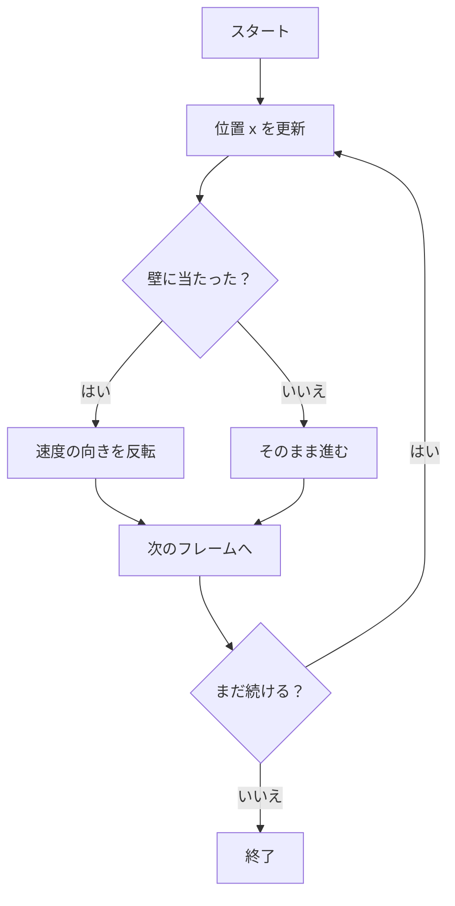

## 01-C1 コンピュータと話す言葉：ロジック

プログラムは、むずかしい呪文ではありません。  
**宇宙のルールをコンピュータに教える命令書**です。

この章では、最初の2つの魔法を学びます。

- もし〜なら（IF）
- くりかえし（LOOP）

この2つだけでも、ボールの動きやゲームのルールを作れます。

### 1. 導入：コンピュータは「超高速な算数マシン」

人が 1 秒に 1 回くらい数えるとしたら、  
コンピュータは 1 秒に何億回も計算できます。

でも、速いだけでは動けません。  
**何をどうするかのルール**を、私たちが教える必要があります。

たとえば：

- 「1ずつ進む」
- 「壁に当たったら向きを変える」
- 「これをずっと続ける」

このルールを言葉にして渡すのが、プログラミングです。

### 2. 変数と型：情報の「箱」と「ラベル」

プログラムでは、情報を入れる箱を作ります。これが**変数**です。  
そして箱には、「何を入れる箱か」というラベルがあります。これが**型**です。

```ts
let steps: number = 0;      // 数字の箱
let isMoving: boolean = true; // Yes/No の箱
```

`math_01_numbers` の知識を回収すると：

- `number` は「測る量」にも「数える量」にも使える
- `boolean` は世界を2つに分ける離散的な判断（はい / いいえ）

つまり型は、算数で学んだ「量の種類」をコードで守る仕組みです。

### 3. 条件分岐（IF）：世界を分けるルール

`if` は「もし〜なら」を書く道具です。

`science_01_world` でやった観察を思い出そう。  
現象は「条件」で分かれます。

- もし温度が高いなら、氷はとける
- もしボールが壁に当たったら、跳ね返る

TypeScript ではこう書けます：

```ts
if (hitWall) {
  velocity = -velocity;
}
```

これは「壁に当たった」という観察結果を、  
そのままルールへ翻訳した形です。

### 4. ループ（LOOP）：何度も同じことをさせる

コンピュータが特に得意なのは、同じ処理のくりかえしです。  
`math_01_numbers` の「1,2,3... と数える」感覚が、そのまま使えます。

```ts
for (let i = 0; i < 10; i++) {
  steps = steps + 1;
}
```

ここでは「1ずつ足す」を10回くりかえしています。  
これはまさに離散的な操作です。

現実のシミュレーションも、

- ほんの少し時間を進める
- 状態を更新する
- また少し進める

をループで実現しています。

### 5. TypeScriptで書いてみよう（ボールの移動）

文法より、意味に注目して読んでみよう。

```ts
let x: number = 0;          // ボールの位置
let velocity: number = 2;   // 1回で進む量
const wallX: number = 10;   // 壁の位置

for (let frame = 0; frame < 12; frame++) {
  x = x + velocity; // 位置を更新（動く）

  const hitWall: boolean = x >= wallX || x <= 0;
  if (hitWall) {
    velocity = -velocity; // 壁で向きを反転
  }

  console.log(`frame=${frame}, x=${x}, v=${velocity}`);
}
```

この短いコードにも、物理の考え方が入っています。

- 位置 `x`（状態）
- 速度 `velocity`（変化のルール）
- 衝突条件 `if`（イベント）
- 時間ステップ `loop`（連続時間の離散近似）

### 6. ルールの流れを図で見る



### 7. 🚀 未来への伏線コラム

> **🚀 未来への伏線：100万個の原子を動かすには？**
> 今は1つのボールを `if` と `loop` で動かした。  
> でも将来は、同じルールを100万個の粒子に同時に適用したくなる。  
> そのとき活躍するのが GPU と WebGPU。  
> 「もし〜なら」の小さな命令が、何万本もの並列計算に広がって、現代物理のシミュレーションになるんだ。

### 8. やってみよう

#### ワーク1：朝の行動を `if` で書こう
「もし雨なら傘を持つ」のように、3つ書いてみよう。

例：
- もし雨なら、傘を持つ
- もし時間が遅いなら、急いで歩く
- もし宿題を忘れたら、メモを確認する

#### ワーク2：くりかえしを `loop` で書こう
「歯をみがく動き」を10回くりかえす、のような行動を1つ書こう。

例：
- 右へ10回みがく
- 左へ10回みがく

#### ワーク3：ミニ疑似コードを作ろう
次の形で「学校へ行くまで」を書いてみよう。

```ts
for (let step = 0; step < 3; step++) {
  if (/* 条件 */) {
    // 行動A
  } else {
    // 行動B
  }
}
```

### 9. この章のまとめ

- プログラムは、ルールをコンピュータに渡す命令書。
- 変数は情報の箱、型は箱のラベル。
- `if` は観察に基づく分岐ルールを書く道具。
- `loop` は離散的な更新を大量にくりかえす道具。
- この2つの組み合わせが、将来のWebGPUシミュレーションの土台になる。
