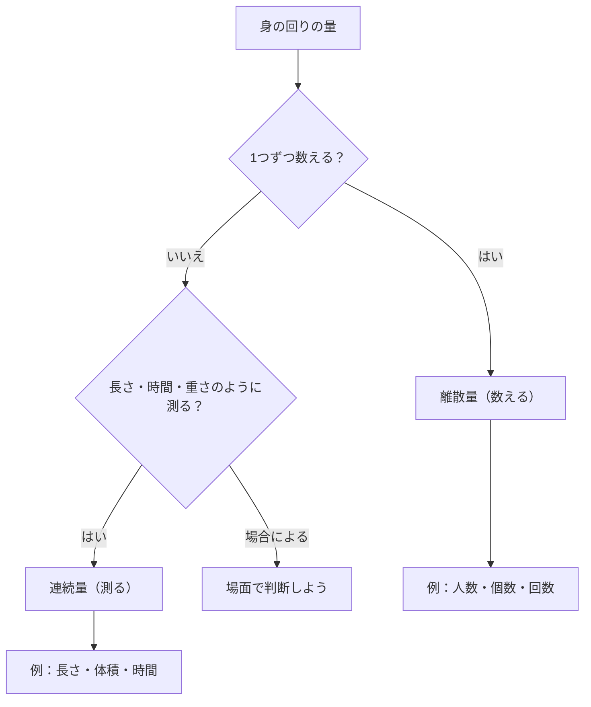

## 01-1 数と量

算数には、大きく2つの見方があります。  
それは **「数える」** と **「測る」** です。

りんごのように「1こ、2こ」と数えるものもあれば、  
コップの水のように「0.5 L、0.75 L」と細かく測るものもあります。  
この違いをつかむと、算数がぐっと深く見えるようになります。

### 1. 「数える」数って何だろう？（離散量）

「数える」数は、1, 2, 3... のように**飛び飛び**です。  
このように、値が点々と並ぶものを「離散（りさん）」と呼びます。

- えんぴつの本数
- 教室にいる人数
- サイコロの目（1〜6）

どれも「途中の 2.4 人」や「3.7 本」はふつう考えません。  
だから、離散量は「ツブツブの世界」と相性がよいのです。

$$
\text{本数} \in \{0,1,2,3,\dots\}
$$

> **🚀 未来への伏線：ツブツブの世界**
> 将来の物理では、物質が原子という小さな粒でできていることを学ぶよ。  
> さらに量子論では、エネルギーまで「とびとびの値」をとる場面がある。  
> 今の「1こずつ数える感覚」は、ミクロな世界を理解する入口なんだ。

### 2. 「測る」量って何だろう？（連続量）

「測る」量は、2 と 3 の間にも、さらにたくさんの値があります。  
このように、切れ目なくつながるものを「連続（れんぞく）」と呼びます。

- ひもの長さ（m）
- 水の体積（L）
- かかった時間（s, h）

たとえば 1 m と 2 m の間には、1.5 m も 1.25 m もあります。  
細かく見れば、もっともっと細かい値を考えられます。

$$
1 < x < 2
$$

この形で表せる値は1つではなく、たくさんあります。  
これが「連続量」のイメージです。

> **🚀 未来への伏線：なめらかな変化**
> 高校以降で学ぶ微分は、「連続に変わる量の変化のしかた」を調べる道具だよ。  
> そして大学物理では、温度や電場のように空間いっぱいに広がる「場」を扱う。  
> 今の「なめらかにつながる量」の感覚が、そこで生きてくるんだ。

### 3. 単位は「ものさし」

数字だけでは、量の意味は決まりません。  
同じ「3」でも、3 個と 3 m ではまったく別ものです。

- 3 個（数える）
- 3 m（長さを測る）
- 3 kg（重さを測る）

だから単位は、**何をどんな基準で見ているかを示す「ものさし」**です。

$$
\text{量}=\text{数値}\times\text{単位}
$$

「1 m」をどう決めるか、「1 s」をどう決めるか。  
この「1 の決め方」がそろっているから、世界中で同じように比べられます。

> **🚀 未来への伏線：物理の共通ルール**
> 物理では、測り方のルールをそろえることがとても大切。  
> 将来は、基準の取り方を変えても本質が変わらないという考え（対称性）にも出会うよ。  
> 単位を意識する習慣は、深い物理を学ぶための土台になる。

### 4. 離散と連続を見分ける図

### 5. 🚀 未来への伏線コラム

> **🚀 未来への伏線：量子のツブツブと空間のキャンバス**
> ふしぎなことに、自然は「ツブツブ」と「なめらかさ」の両方を持っている。  
> 電子のように粒としてふるまうものがある一方で、光や電磁場は空間に広がる波として表せる。  
> つまり、ミクロでは離散が見え、マクロでは連続がよく効く場面が多いんだ。  
> これから学ぶ算数・数学は、その2つをつなぐ共通言語になっていくよ！

### 6. やってみよう

次のものを「離散（数える）」か「連続（測る）」に分けてみよう。

#### 問題1
クラスの出席人数

- ヒント：1人ずつ数える？
- 答え：離散

#### 問題2
ペットボトルに入っている水の量

- ヒント：0.1 L ずつでも考えられる？
- 答え：連続

#### 問題3
1日にゲームをした時間

- ヒント：30分、45分、52分... のように表せる？
- 答え：連続

#### 問題4
サイコロをふって出た目

- ヒント：2.5 は出る？
- 答え：離散

### 7. この章のまとめ

- **離散量**は、1,2,3... のように飛び飛びの値をとる。
- **連続量**は、途中の値をどこまでも細かく考えられる。
- 算数では「数える」と「測る」を使い分けることが大切。
- **単位**は、量を正しく読むための「ものさし」。
- この見方は、未来の物理（量子論・微分・場の理論）へつながる土台になる。
