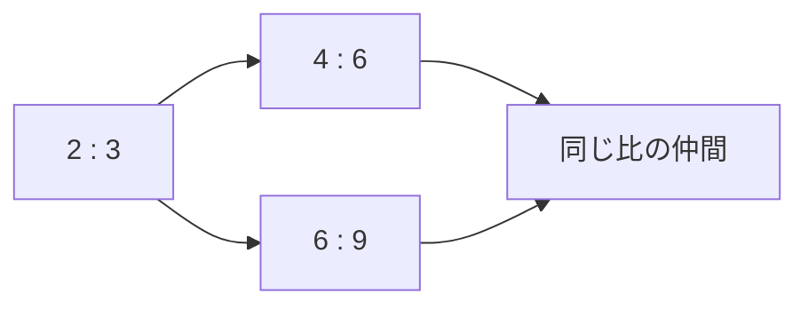
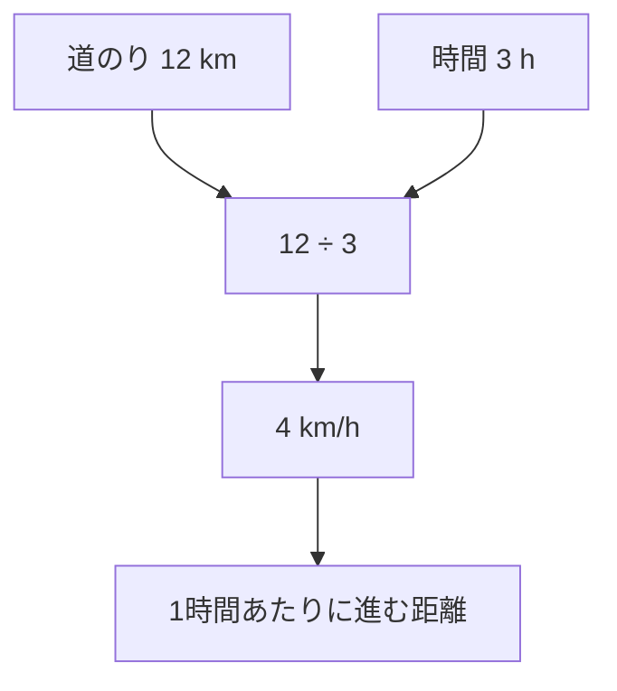

## 01-2 比と割合

「どっちが大きいか」だけでなく、**どれくらいの関係か**を表すのが「比」と「割合」です。  
この章では、ピザやジュースのような身近な例を使って、算数の考え方を育てます。

### 1. 比って何だろう？

比は、2つの量の「関係」を表す言い方です。

- りんごが 2 個、みかんが 3 個  
- このとき、りんご : みかん = 2 : 3

ここで大切なのは、比は「個数そのもの」ではなく、**関係の形**を表していることです。

#### 同じ形の比

2:3 は、4:6 や 6:9 と同じ関係です。  
どちらも「2 と 3 の関係」を大きくしただけだからです。

### 2. 割合って何だろう？

割合は、「もとにする量」を 1 と見たときの大きさです。

- クラス 20 人のうち、8 人がメガネ  
- 割合は 8 ÷ 20 = 0.4  
- 0.4 は 40% と同じ意味

つまり割合は、**部分 ÷ 全体**で求められます。

$$
\text{割合}=\frac{\text{くらべる量}}{\text{もとにする量}}
$$

### 3. 比と割合はどうつながる？

比と割合は、見た目は違っても中身はつながっています。

- 比 2:5  
- 割合にすると 2 ÷ 5 = 0.4 = 40%

「比」は関係をそのまま見せる形、  
「割合」は 1 あたりにそろえて見る形です。

### 4. 単位が変わるってどういうこと？

ここがこの章のいちばん大事なポイントです。  
算数では、数字だけでなく**単位の組み合わせ**にも注目します。

#### 例：速さ

- 12 km を 3 h で進んだ
- 1 時間あたりどれだけ進むかは 12 ÷ 3 = 4
- 単位は km ÷ h なので **km/h**

$$
\text{速さ}=\frac{\text{道のり (km)}}{\text{時間 (h)}}=4 \text{ km/h}
$$

ここで起きているのは、ただの割り算ではありません。  
**km と h という2つの単位が合わさって、新しい意味の単位 km/h が生まれた**のです。

> **🚀 物理への伏線：瞬間の速度へ**
> 今は「ある時間ぜんたい」での速さ（平均の速さ）を求めたね。  
> 将来の高校物理では、もっと細かく「この一瞬の速さは？」を考えるようになる。  
> それが「瞬間の速度」で、数学では微分という考え方につながっていくんだ。  
> いま学んでいる **km/h の意味を単位ごと読む力** が、その第一歩だよ！

### 5. やってみよう

#### 問題1
ジュース 3 L を 6 人で同じように分けます。  
1 人ぶんは何 L ですか。

- 式：3 ÷ 6
- 答え：0.5 L

#### 問題2
24 km を 4 h で進みました。速さは何 km/h ですか。

- 式：24 ÷ 4
- 答え：6 km/h

#### 問題3
40 人のクラスで、10 人が左利きです。割合は何%ですか。

- 式：10 ÷ 40 = 0.25
- 答え：25%

### 6. この章のまとめ

- **比**は、2つの量の関係を表す。
- **割合**は、もとにする量を 1 としたときの大きさ。
- 割り算では、数字だけでなく**単位もいっしょに考える**。
- km と h から km/h ができるように、単位の変化は意味の変化。
- この見方は、未来の物理（瞬間の速度・微分）につながる大切な土台。
