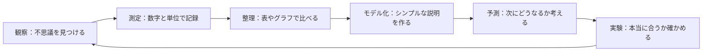

## 01-3 科学の目：世界を測る

科学は、むずかしい式から始まりません。  
最初の一歩は「どうしてだろう？」「不思議だな」という気持ちです。

でも、そこで次の質問が生まれます。  
**「どれくらい熱い？」「どれくらい速い？」**  
この「どれくらい？」に答えるために、数字と単位が必要になります。

### 1. 観察と測定

まずは目で見たり、手で触れたりして「観察」します。  
ただし、五感だけでは人によって感じ方が変わります。

- 「今日は暑い！」（でも人によって違う）
- 「このカバン重い！」（感じ方はバラバラ）
- 「あの子、走るの速い！」（正確な比較はむずかしい）

ここで活躍するのが、道具です。

- 温度計：温度を測る
- はかり：重さを測る
- 時計：時間を測る

道具を使うと、感覚の言葉が**みんなで共有できる量**に変わります。

$$
\text{量}=\text{数値}\times\text{単位}
$$

たとえば「暑い」ではなく「30 ℃」と言えれば、  
だれとでも同じ情報を話せるようになります。

### 2. 🎯 知識の回収（math_01_numbersより）

算数で学んだ「離散」と「連続」を、理科で回収しよう。

- **離散**：1つずつ数える世界（ツブツブ）
- **連続**：なめらかに変わる世界（切れ目がない）

理科では、この2つを両方使います。

- 物質は原子という粒の集まりとして見られる（離散）
- 物が動く空間や時間は、なめらかに続くものとして扱う（連続）

つまり、世界は「ツブツブ」と「なめらか」が協力してできています。

> **🎯 あの時の知識を回収！**
> `math_01_numbers` で学んだ「数える」と「測る」の違いは、理科でそのまま使う土台だよ。  
> 粒を数える目（離散）と、変化を追う目（連続）の両方を持つと、自然の見え方が一気に豊かになる。

### 3. 標準（スタンダード）の物語

想像してみよう。  
もし「1メートル」が人によって違ったら、どうなるかな？

- Aさんの 1 m と Bさんの 1 m が違う
- 同じ机を測っても結果がバラバラ
- 実験結果を比べられない

これでは科学が進みません。  
だから世界では、共通の単位ルール（SI単位系）を使います。

- 長さ：m
- 質量：kg
- 時間：s

単位がそろうと、国や時代が違っても結果を比べられます。  
これは科学の「共通言語」です。

> **🚀 未来への伏線：次元という見えないラベル**
> 物理では、長さ・質量・時間をそれぞれ [L], [M], [T] のような「次元」で表すよ。  
> たとえば速さは「長さ ÷ 時間」なので [L/T]。  
> このラベルを見ると、式が正しいかをチェックできるんだ。

### 4. モデル化の第一歩

現実の世界は、とても複雑です。  
そこで科学では、必要な部分だけを取り出して**モデル化**します。

たとえば飛んでいるボールは、本当は大きさも回転もあります。  
でも最初は「点」として考えると、動きをシンプルに調べられます。

- 現実：ボール（大きさ・回転・空気の影響あり）
- モデル：点（位置だけに注目）

「全部を一気に説明しない」のは手抜きではなく、  
本質をつかむための賢い方法です。

### 5. 観察から法則発見までのループ

科学は一回で終わりません。  
このループを回しながら、説明をどんどんよくしていきます。

### 6. 🚀 未来への伏線コラム

> **🚀 未来への伏線：測れば測るほど正確になる？**
> たしかに、ていねいに測るほどデータはよくなる。  
> でも実は、自然には「どこまでも同時に正確には決められない」性質もあるんだ。  
> 高校・大学で学ぶ量子の世界では、位置と運動の情報に限界があること（不確定性原理）に出会う。  
> だからこそ科学は、「正確に測る技術」と「限界を正しく理解する知恵」の両方が大切なんだよ。

### 7. やってみよう

家や教室で、次のミニ活動をやってみよう。

#### 活動1：同じものを別の人で測る
消しゴムの長さを、2人で別々に測ってみよう。

- 使うもの：定規
- 記録するもの：長さ（cm）
- 観察ポイント：測り方をそろえると結果は近づく？

#### 活動2：10秒チャレンジ
目を閉じて「10秒たった」と思ったら手を上げる。  
そのあと時計で本当の時間を確認しよう。

- 感覚だけの時間と、時計の時間は同じだった？
- 道具の大切さを言葉でまとめてみよう。

#### 活動3：モデルを作る
投げたボールの動きを、まずは「点」でノートに描いてみよう。

- どんな情報を捨てた？
- それでも何がわかる？

### 8. この章のまとめ

- 科学は「不思議」を、数字と単位で共有する学び。
- 五感の観察は大切だが、測定でだれでも比べられる情報になる。
- **離散**と**連続**は、理科でも重要な2つの見方。
- 単位の標準（SI）は、世界で協力して科学を進める土台。
- モデル化は、複雑な現実から本質を取り出す強力な道具。
