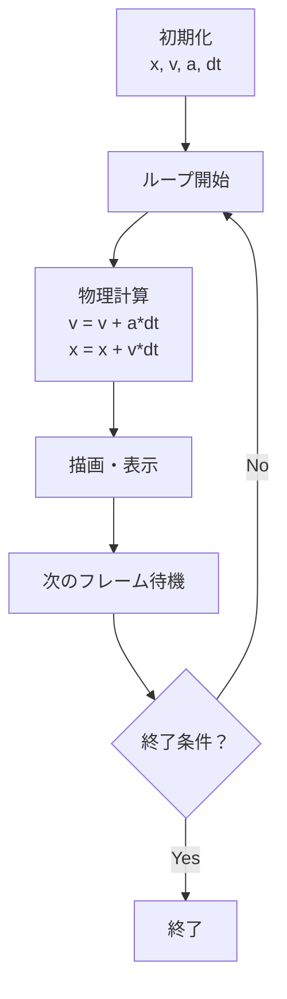

## 02-C1 法則をコードで動かす：シミュレーション入門

ノートの上では、数式は静かに止まっています。  
でもコンピュータに時間を流すと、数式は動き出します。  
それがシミュレーションです。

この章のテーマはシンプル。  
**数式は世界の設計図であり、コードはそれを動かすエンジン**です。

### 1. 導入：数式が動き出す瞬間

たとえば、位置を $x$、速度を $v$ とします。  
紙の上ではただの文字でも、時間 $\Delta t$ ごとに更新すると運動になります。

$$
x_{\text{new}} = x_{\text{old}} + v \cdot \Delta t
$$

この1行だけで、「止まった式」から「動く世界」へ変わります。

### 2. 変数と状態：文字式をメモリに載せる

`math_01_algebra` で学んだ文字式を、TypeScript の変数として置きます。

```ts
let x: number = 0; // 位置 [m]
let v: number = 5; // 速度 [m/s]
let a: number = 0; // 加速度 [m/s^2]
```

ここで `x`, `v`, `a` は「状態」です。  
コンピュータはこの状態を毎フレーム更新し続けます。

型 `number` は同じでも、  
コメントで単位を付けると次元意識を保てます。

- `x` は長さ
- `v` は長さ/時間
- `a` は長さ/時間²

これは Phase 1 から続く「単位を読む力」の実装版です。

### 3. 「=」の再定義：等号から「更新」へ

ここは最重要ポイントです。

数学では

$$
x=x+v
$$

はふつう成り立ちません。  
でもプログラミングの `=` は「等しい」の記号ではなく、**代入（更新）**です。

```ts
x = x + v * dt;
```

これは

- 右辺：今の値で計算
- 左辺：計算結果を新しい `x` として保存

という意味です。  
つまり `=` は「時間を1コマ進める命令」です。

### 4. 🎯 知識の回収（Phase 2 Physicsより）

`physics_01_force` で学んだ「力は変化の原因」をコード化します。

力学の基本は

$$
a=\frac{F}{m}
$$

そして更新は2段構えです。

$$
v_{\text{new}} = v_{\text{old}} + a \cdot \Delta t
$$

$$
x_{\text{new}} = x_{\text{old}} + v_{\text{new}} \cdot \Delta t
$$

TypeScript ではこう書けます。

```ts
v = v + a * dt; // 力の結果、速度が変わる
x = x + v * dt; // 変わった速度で位置が変わる
```

「原因（力）→速度変化→位置変化」がそのまま読めます。

### 5. シミュレーション・ループ：時間のコマ送り

シミュレーションは、パラパラ漫画と同じ発想です。

1. 計算する（物理ルール）
2. 描画する（見える形にする）
3. 次のコマへ進む

これを繰り返します。  
JavaScript/TypeScript では、たとえば次を使います。

- `requestAnimationFrame`: 画面描画と同期した更新
- `setInterval`: 一定間隔の更新

### 6. TypeScriptで書く：等速と等加速度

#### 例1：等速直線運動（$a=0$）

```ts
let x: number = 0;    // [m]
let v: number = 3;    // [m/s]
const dt: number = 0.1; // [s]

for (let step = 0; step < 10; step++) {
  x = x + v * dt; // x_new = x_old + v*dt
  console.log(`t=${(step + 1) * dt}s, x=${x.toFixed(2)}m`);
}
```

#### 例2：重力落下（等加速度）

```ts
let y: number = 10;       // 高さ [m]
let v: number = 0;        // 速度 [m/s]（下向きをマイナスにする）
const g: number = -9.8;   // 重力加速度 [m/s^2]
const dt: number = 0.016; // 時間刻み [s]（約60fps）

for (let step = 0; step < 120; step++) {
  v = v + g * dt; // 速度更新：v_new = v_old + a*dt
  y = y + v * dt; // 位置更新：y_new = y_old + v*dt

  if (y <= 0) {
    y = 0;
    v = -0.7 * v; // 地面で少し跳ね返る（エネルギーは減る）
  }

  console.log(`step=${step}, y=${y.toFixed(3)}m, v=${v.toFixed(3)}m/s`);
}
```

### 7. シミュレーションの流れ



### 8. 🚀 未来への伏線コラム

> **🚀 未来への伏線：カオスと予測不能な世界**
> シミュレーションは法則が同じでも、初期値が少し違うだけで未来が大きく変わることがある。  
> これはカオス系で特に顕著で、「決定論なのに予測が難しい」世界を生む。  
> 将来は、微分方程式を数値的に解く方法（オイラー法・ルンゲクッタ法など）で、  
> こうした複雑な世界をコンピュータ上で実験できるようになる。

### 9. やってみよう

#### 実験1：重力を変える
上の落下コードの `g` を変えて、違いを観察しよう。

- 地球：`g = -9.8`
- 月：`g = -1.62`
- 木星：`g = -24.8`（近似）

**観察ポイント**：
- 地面に着くまでの時間
- 跳ね返りのテンポ
- 速度の増え方

#### 実験2：時間刻みを変える
`dt` を `0.1` と `0.016` で比較しよう。

**観察ポイント**：
- 動きの滑らかさ
- 計算誤差の出方

#### 実験3：自分ルールを1つ足す
例：
- 空気抵抗（`v` が大きいほど減速）
- 風（一定の横向き加速度）

「法則を追加すると世界がどう変わるか」をメモしよう。

### 10. この章のまとめ

- 文字式は、時間更新を与えるとシミュレーションになる。
- プログラミングの `=` は等号ではなく「更新命令」。
- 力学は `v` 更新と `x` 更新の2段で実装できる。
- ループは時間のコマ送りであり、世界を動かす心臓部。
- コードを書き換えることで、法則の実験を自分でできる。
