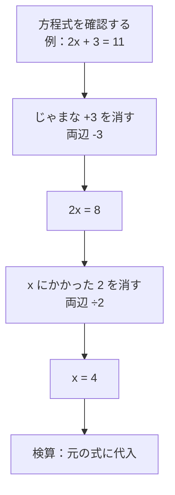

## 02-1 未知を文字に託す：代数の力

算数では、具体的な数字を使って答えを出してきました。  
中学数学ではここから一歩進んで、**文字**を使って「どんな場合にも通じるルール」を書けるようになります。

10 や 5 だけに通用する計算から、  
「どんな数でも成り立つ形」へ。  
これが、代数のいちばん大きなジャンプです。

### 1. 導入：箱の中身は何だろう？

小学校で見た「□」を覚えているかな？  
中学ではこの □ を、$x$ や $a$ のような文字で表します。

- □ + 3 = 8
- $x + 3 = 8$

文字は「まだわからないけれど、確かにある量」を扱うための道具です。  
未知の量を名前で呼べるようになると、考え方が一気に整理されます。

### 2. 文字式：世界を「型」で表す

具体例から見てみよう。

- りんご3個と5個を合わせると8個
- りんご$n$個と$m$個を合わせると $n+m$ 個

前者は1つの場面だけ。  
後者は、どんな個数にも使える**型（テンプレート）**です。

$$
3+5=8,\quad n+m=\text{合計個数}
$$

文字式の強さは、「1回書けば何度も使える」こと。  
これは `science_01_world` で学んだ**モデル化**の数学版です。

- 現実のたくさんのパターン
- 文字式というシンプルなモデル
- 必要なときに数値を代入して答えを出す

### 3. 🎯 知識の回収（Phase 1より）

`math_01_numbers` で学んだ「離散」と「連続」を、文字で表してみよう。

- 離散（1つずつ数える）：$n$ を整数として使う
- 連続（なめらかに変わる）：$x$ を実数として使う

たとえば、人数なら $n=1,2,3,\dots$ のように飛び飛び。  
時間や長さなら、$x=1.2,1.23,1.234,\dots$ のように連続的に扱えます。

> **🎯 あの時の知識を回収！**
> 「文字はただの記号」ではなく、どんな量を表すかという意味を持っている。  
> 整数を表す文字か、連続量を表す文字かで、考えられる世界が変わるんだ。

さらに、Phase 1で大切にした単位の視点もそのまま続きます。  
たとえば $x$ が長さなら次元は [L]、$t$ が時間なら [T]。  
式の中の文字には、数字だけでなく**物理量の意味**が隠れています。

### 4. 等式の性質：天秤（バランス）の原理

方程式を解くとは、「左右のバランス」を保ちながら変形することです。

$$
2x+3=11
$$

両辺から3を引く：

$$
2x+3-3=11-3
$$

$$
2x=8
$$

両辺を2で割る：

$$
\frac{2x}{2}=\frac{8}{2}
$$

$$
x=4
$$

この手順の本質はいつも同じです。  
**左と右に同じ操作をする**から、等式が壊れない。

> **🚀 未来への伏線：保存則の感覚**
> 方程式でバランスを守る感覚は、物理の保存則（エネルギー保存など）につながる。  
> 「変えてよいもの」と「変わってはいけないもの」を見分ける目が、ここで育っていくんだ。

### 5. 代入という魔法

文字式を先に作っておけば、あとから観測した数字を入れるだけで使えます。

たとえば、一定の加速度運動の基本形の1つとして

$$
v=at
$$

を考えます（$v$：速さ、$a$：加速度、$t$：時間）。

$a=2 \text{ m/s}^2,\ t=3 \text{ s}$ を代入すると

$$
v=2\times 3=6 \text{ m/s}
$$

このとき単位も確認できます。

$$
[v]=[a][t]=\left[\frac{L}{T^2}\right][T]=\left[\frac{L}{T}\right]
$$

数字を入れるだけでなく、**単位（次元）まで一緒に読む**のがSTEM流です。

### 6. 方程式を解く流れ（逆演算フロー）

### 7. 🚀 未来への伏線コラム

> **🚀 未来への伏線：文字が表すのは数字だけじゃない**
> 今は $x,y,a$ を「数」として使っているね。  
> でも高校・大学では、文字が関数 $f(x)$ を表したり、行列 $A$ を表したりする。  
> さらに量子力学では、文字が「演算子（状態に働きかけるルール）」を表すこともある。  
> 代数は、数字の計算テクニックではなく、世界のルールを記述する言語なんだ。

### 8. やってみよう

#### 問題1
式 $y=3x+1$ に $x=4$ を代入しなさい。

- 計算：$y=3\times 4+1$
- 答え：$y=13$

#### 問題2
方程式 $5x-7=18$ を解きなさい。

- 両辺に 7 を足す：$5x=25$
- 両辺を 5 で割る：$x=5$

#### 問題3
式 $v=at$ で、$a=1.5 \text{ m/s}^2,\ t=4 \text{ s}$ のとき $v$ を求めなさい。

- 計算：$v=1.5\times 4=6$
- 答え：$6 \text{ m/s}$

#### 問題4
次のうち、離散量を表す文字として自然なのはどれ？

- A. クラスの人数を表す $n$
- B. 温度を表す $x$

答え：A（人数は通常、整数で数えるため）

### 9. この章のまとめ

- 文字は、未知の量や一般的なルールを表すための道具。
- 文字式は、多くの場面を1つの「型」でまとめるモデル化の方法。
- `Phase 1` の **離散** と **連続** は、文字の使い分けにも現れる。
- 方程式は、左右のバランスを守って変形する（天秤の原理）。
- 代入を使うと、一般式に観測値を入れてすぐ答えを出せる。
