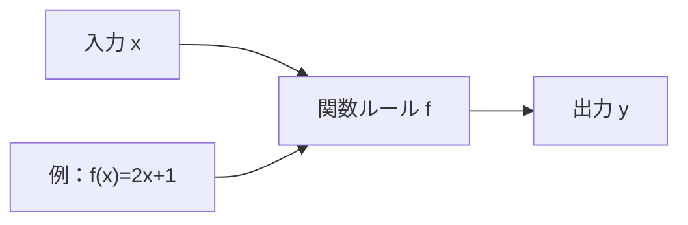
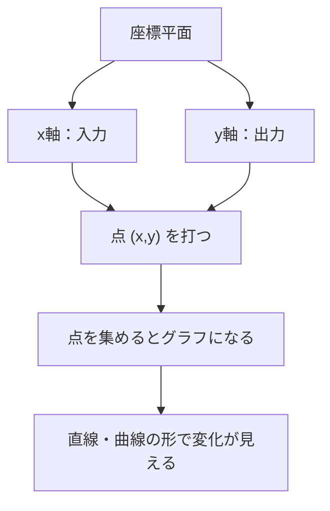

## 02-2 変化を記述する：関数の世界

前章では、文字式を使って「どんな場合にも使える型」を作りました。  
この章ではその型を、**変化する世界**に使っていきます。

時間が変わると、距離が変わる。  
ばねを引くと、のびが変わる。  
この「片方が変わると、もう片方も変わる」という関係を記述するのが関数です。

### 1. 導入：変化する二つの量

たとえば、毎秒 2 m でまっすぐ進む人を考えます。

- 1 秒後：2 m
- 2 秒後：4 m
- 3 秒後：6 m

ここでは「時間 $t$」が変わると、「距離 $d$」も決まって変わります。  
このような関係性を、式で表すと

$$
d=2t
$$

となります。  
関数は、「変化を追いかけるための言語」です。

### 2. 関数は「自動販売機（変換マシン）」

関数を、ブラックボックスの機械として見てみよう。

- 入力：$x$
- ルール：$f$
- 出力：$y$

この関係を

$$
y=f(x)
$$

と書きます。  
中学では主に $y=ax+b$ の形を学ぶけれど、考え方は同じです。  
**入力を入れると、ルールに従って出力が1つ決まる**。これが関数の核心です。

### 3. 🎯 知識の回収（Phase 1より）

`math_02_ratio` で学んだ「比と割合」は、実は関数そのものです。

#### 比例は「比が一定」の関数

比例の式は

$$
y=ax
$$

でした。  
これは

$$
\frac{y}{x}=a\ (\text{一定})
$$

という意味です。  
つまり比例は、「入力が2倍なら出力も2倍」という特別なルールを持つ関数です。

#### 反比例も関数

$$
y=\frac{k}{x}
$$

では、$x$ が大きくなると $y$ は小さくなります。  
これも立派な関数です。

> **🎯 あの時の知識を回収！**
> 小学校で学んだ比例・反比例は、関数の最重要メンバー。  
> 算数の「比の見方」が、中学で「変化を記述する道具」に進化したんだ。

### 4. 座標とグラフ：関係を「形」にする

数の関係を、平面に点として置くとグラフになります。  
グラフの強みは、計算しなくても変化の様子が見えることです。

- $x$ 軸：入力（原因側）
- $y$ 軸：出力（結果側）
- 1点 $(x,y)$：1つの対応

たとえば一次関数

$$
y=ax+b
$$

は、直線になります。  
$a$ は傾き、$b$ は切片です。

> **🚀 未来への伏線：傾きから微分へ**
> 直線の傾きは「1増えるとどれだけ増えるか」を表す。  
> 高校ではこの考え方が、曲線のその瞬間の傾き（微分）へ発展する。  
> いまのグラフの見方が、そのまま未来の力学につながるよ。

### 5. 変域：動ける範囲

式だけを見ると、$x$ はどんな数でも入れられそうです。  
でも現実の問題では、動ける範囲（変域）があります。

例：$d=2t$（距離と時間）

- 数学的には $t$ に負の数も入れられる
- 物理的には「経過時間」はふつう $t \ge 0$

このように、**数理モデル（式）と現実の条件（制約）**をセットで考えることが大切です。

単位も同時に確認しよう。

$$
[d]=[L],\ [t]=[T],\ \left[\frac{d}{t}\right]=\left[\frac{L}{T}\right]
$$

式が正しくても、単位が合わなければ意味が崩れます。

### 6. 🚀 未来への伏線コラム

> **🚀 未来への伏線：関数は数を入れるだけじゃない？**
> ここでは「1つの数を入れて、1つの数が出る」関数を学んだ。  
> でも物理では、空間の各点に温度や電場の向きを割り当てる「場（フィールド）」を扱う。  
> つまり関数は、点ごとに情報を配る地図のような存在にもなるんだ。  
> 関数を使いこなすことは、未来の電磁気学や量子論へのパスポートになる。

### 7. やってみよう

#### 問題1：比例の式を作る
ある物体が一定の速さ 3 m/s で進む。  
時間を $t$ 秒、進んだ距離を $d$ m とするとき、式を作りなさい。

- 答え：$d=3t$

#### 問題2：値を求める
問題1の式で、$t=5$ のときの距離を求めなさい。

- 計算：$d=3\times 5$
- 答え：$15 \text{ m}$

#### 問題3：一次関数の読み取り
$$
y=2x-1
$$
で、$x=0,1,2$ のときの $y$ を求めなさい。

- $x=0 \Rightarrow y=-1$
- $x=1 \Rightarrow y=1$
- $x=2 \Rightarrow y=3$

#### 問題4：変域を考える
式 $d=4t$ がある。時間は 0 秒から 10 秒までとする。  
$t$ の変域と、$d$ の取りうる範囲を答えなさい。

- $0 \le t \le 10$
- $0 \le d \le 40$

### 8. この章のまとめ

- 関数は、変化する2つの量の関係を記述するルール。
- 関数は「入力 → ルール → 出力」の変換マシンとして理解できる。
- 比例・反比例は、Phase 1で学んだ内容が進化した基本関数。
- グラフは、関係性を「形」として見せる強力な道具。
- 変域と単位を意識すると、式を現実のモデルとして正しく使える。
