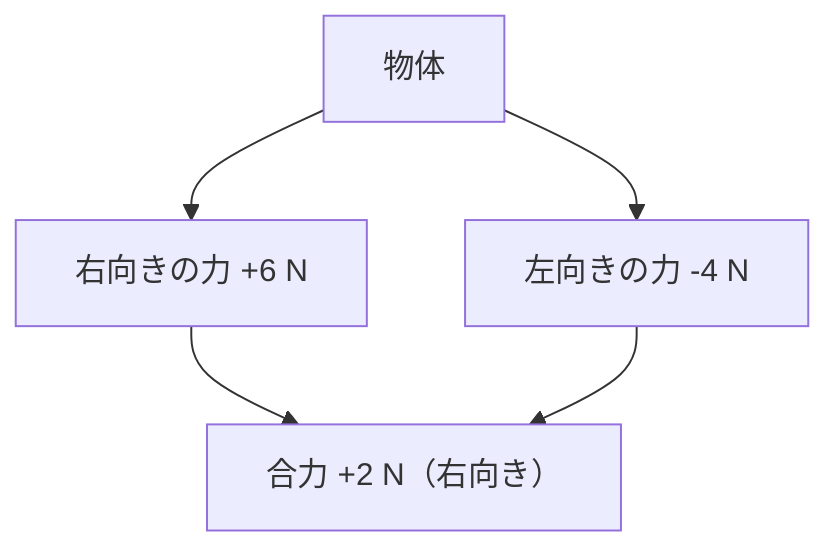

## 02-3 力を可視化する：力と運動

風そのものは見えないのに、木の葉がゆれる。  
重力そのものは見えないのに、ボールは下に落ちる。  
つまり私たちは、**力そのもの**ではなく、**力が起こした変化**を見ています。

この章では、見えない力を「見える形」に変えて、  
数学で扱えるモデルにしていきます。

### 1. 導入：目に見えない「力」をどう捉えるか？

力は、だいたい次の2つの変化として現れます。

- 形を変える（スポンジを押すとへこむ）
- 動きを変える（止まっていた台車が動き出す）

理科では、この「変化の原因」を力として考えます。  
見えないものでも、結果を手がかりにすれば科学的に扱える。  
ここが物理の面白さです。

### 2. 力の三要素（モデル化）

力を正しく表すには、3つの情報が必要です。

- **作用点**：どこに力がかかるか
- **向き**：どちら向きか
- **大きさ**：どれくらい強いか

この3つを一度に表せる道具が、**矢印（ベクトル）**です。  
矢印は、現実を数学に翻訳するモデルです。

- 矢印の始まり：作用点
- 矢印の向き：力の向き
- 矢印の長さ：力の大きさ

> **🚀 未来への伏線：ベクトルの登場**
> ここで使う「矢印で表す」考え方は、高校のベクトルや大学の力学へ直結する。  
> ただの図ではなく、計算できる言語として育っていくんだ。

### 3. 🎯 知識の回収（Phase 2 Mathより）

`math_02_function` で学んだ  
「入力 → ルール → 出力」を力学で読み替えるとこうなります。

- 入力：力（どれだけ押すか、引くか）
- ルール：物体の性質（重さ・摩擦など）
- 出力：運動の変化（速さの変化、向きの変化）

さらに `math_01_algebra` の視点も重要です。  
右向きをプラスと決めたなら、左向きはマイナスで表せます。

$$
F_{\text{right}}=+5,\quad F_{\text{left}}=-5
$$

向きが逆の力を負の数で書けると、  
「図」と「式」がきれいにつながります。

### 4. 重さと質量の違い（次元の意識）

ここは特に大切です。  
日常では混ざりがちですが、物理では区別します。

- **質量**：どれだけ物質があるか（単位 kg）
- **重さ（重力による力）**：どれだけ引っぱられるか（単位 N）

質量は場所が変わっても基本的に同じ。  
重さは、月と地球で変わります（重力の強さが違うため）。

重さは力なので、次元は [ML/T²] です。

$$
1\ \text{N}=1\ \text{kg}\cdot\text{m/s}^2
$$

`science_01_world` で学んだように、  
**数字だけでなく単位と次元を見る**ことで、意味の取り違えを防げます。

### 5. 力のつり合い：合計がゼロの世界

左右から同じ強さで引っ張ると、物体は動きません。  
このとき力は「つり合っている」と言います。

式では、合力（全部の力の和）が 0 です。

$$
F_1+F_2=0
$$

例：右向き 8 N、左向き 8 N

$$
+8+(-8)=0
$$

動かないことと、式の「0」が対応している。  
これが、物理で式を使う気持ちよさです。

> **🚀 未来への伏線：静力学への入口**
> 合力が0という見方は、建物や橋の安定を調べる静力学の基本。  
> さらに「作用・反作用」の法則を理解するときの土台にもなるよ。

### 6. 力の合成・分解を図で見る

複数の力があるときは、向きをそろえて足し算します。  
必要なら、1つの力を2方向に分解して考えることもあります。  
図にしてから式にすると、ミスがぐっと減ります。

### 7. 🚀 未来への伏線コラム

> **🚀 未来への伏線：力がなければ、物は止まり続ける？**
> 実は逆で、「合力が0なら、止まっている物体は止まり続け、動いている物体は同じ速さで動き続ける」。  
> これが慣性の法則の考え方。  
> そして高校では、力と運動の変化をつなぐ式 $F=ma$ に出会う。  
> いま学んだ「力を矢印で表し、向きを込めて足す」技術が、そのまま運動方程式を読む鍵になるんだ。

### 8. やってみよう

#### 問題1：つり合いの計算
右向きに 10 N、左向きに 10 N の力がはたらく。合力を求めなさい。

- 式：$+10+(-10)$
- 答え：$0\ \text{N}$

#### 問題2：合力の向き
右向きに 12 N、左向きに 5 N の力がはたらく。合力を求めなさい。

- 式：$+12+(-5)=+7$
- 答え：$7\ \text{N}$（右向き）

#### 問題3：ばねばかりと比例（フックの法則の入口）
ばねののび $x$（cm）と力 $F$（N）が比例し、  
$x=2$ のとき $F=6$ だった。比例定数 $a$ を求め、式 $F=ax$ を作りなさい。

- $6=a\cdot 2$ より $a=3$
- 答え：$F=3x$

#### 問題4：代入して予測
問題3の式で $x=5$ のとき、力 $F$ はいくつ？

- 計算：$F=3\times 5$
- 答え：$15\ \text{N}$

### 9. この章のまとめ

- 力は目に見えないが、「形や運動の変化」から捉えられる。
- 力は作用点・向き・大きさの3要素を持ち、矢印でモデル化できる。
- 関数の「入力→ルール→出力」は、力学でもそのまま使える。
- 逆向きの力は負の数で表せるので、代数と力学がつながる。
- 質量（kg）と重さ（N）を区別し、単位と次元まで読むことが重要。
