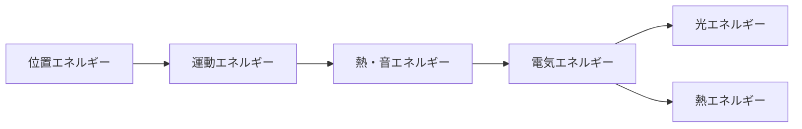

## 02-4 宇宙の通貨：仕事とエネルギー

力の章で学んだように、力は「変化の原因」でした。  
この章では、さらに一歩進んで考えます。  
**どれくらい変化させる能力があるか**を表す共通のものさし、それがエネルギーです。

エネルギーは、世界を動かすための「チケット」のようなもの。  
チケットがあれば、持ち上げる・走らせる・光らせることができます。

### 1. 導入：エネルギーは「宇宙を動かすチケット」

たとえば次のような場面を見てみよう。

- 電池でライトが光る
- 人が階段をのぼる
- ボールがころがってピンを倒す

どれも「何かが変わる」現象です。  
この変化には、エネルギーの出入りがあります。

力だけを見ていると、「どれだけ大変だったか」が見えにくいことがあります。  
そこで物理では、エネルギーという共通の通貨で比べます。

### 2. 仕事（Work）の定義：力 × 距離

力をかけて、さらにその方向に物体が動いたとき、  
その量を**仕事**と呼びます。

$$
W=Fs
$$

（$W$：仕事、$F$：力、$s$：力の向きに動いた距離）

ここで大事なポイント：

- 強い力でも、動かなければ仕事は 0
- 小さい力でも、長い距離を動かせば仕事は大きくなる

たとえば、壁を全力で押しても壁が動かなければ

$$
s=0 \Rightarrow W=F\times 0=0
$$

となります。  
これは `physics_01_force` の「力」概念が、より上位の見方に広がった瞬間です。

### 3. 🎯 知識の回収（Phase 1 Math & Scienceより）

`math_02_ratio` で学んだ「単位の掛け算」を思い出そう。  
仕事の単位は

$$
\text{N}\times \text{m}=\text{J}
$$

です。  
この **J（ジュール）** が、エネルギーの代表単位になります。

さらに次元を見ると、

$$
[W]=[F][s]=\left[\frac{ML}{T^2}\right][L]=[ML^2T^{-2}]
$$

となり、エネルギーの次元が見えてきます。

`science_01_world` の言葉で言えば、  
これは「単位を読むことで、現象の意味を読む」練習です。

#### 仕事の原理（保存の芽）

道具を使うと、必要な力は小さくできることがあります。  
でも、そのぶん長い距離を動かす必要がある。  
**必要な仕事（エネルギーの総量）は、理想的には同じ**というのが仕事の原理です。

### 4. 位置エネルギーと運動エネルギー（モデル化）

エネルギーにはいろいろな形があります。  
中学で特に重要なのは次の2つです。

- **位置エネルギー**：高い場所にあることで持つエネルギー
- **運動エネルギー**：動いていることで持つエネルギー

文字式で書くと、

$$
U=mgh
$$

$$
K=\frac{1}{2}mv^2
$$

です（$m$：質量、$g$：重力加速度、$h$：高さ、$v$：速さ）。

ここでも `math_01_algebra` の視点が効きます。  
式は「型」であり、観測した値を代入すると具体的な予測になります。

また `math_01_numbers` の見方では、エネルギーは連続量です。  
0.1 J、0.01 J のように細かく扱えます。

### 5. エネルギー保存の法則：形は変わる、合計は変わらない

ローラーコースターを想像しよう。

- 高い場所：位置エネルギーが大きい
- 低い場所：運動エネルギーが大きい

上から下へ進むと、位置エネルギーが減り、運動エネルギーが増えます。  
でも摩擦を無視できる理想化では、合計は一定です。

$$
K+U=\text{一定}
$$

これは物理学で最も強力なルールの1つです。  
「何が変わって、何が変わらないか」を見抜く目を育てます。

### 6. エネルギー変換の図

エネルギーは「消える」のではなく、別の形に変わる。  
図で見ると、現象同士のつながりがよくわかります。

### 7. 🚀 未来への伏線コラム

> **🚀 未来への伏線：消えたエネルギーの行方は？**
> 「運動エネルギーが減ったのに、どこへ行った？」という疑問はとても重要。  
> 多くの場合、摩擦で熱に変わったり、音として周囲へ広がったりしている。  
> 大学では、この見方が解析力学（ラグランジアン）や熱力学第二法則（エントロピー）につながる。  
> いまの保存則の感覚は、未来の物理を理解する最強のコンパスになるよ。

### 8. やってみよう

#### 問題1：仕事の計算
10 N の力で、同じ向きに 3 m 物体を動かした。仕事を求めなさい。

- 式：$W=Fs=10\times 3$
- 答え：$30\ \text{J}$

#### 問題2：動かないとき
20 N で押したが、物体は動かなかった。仕事はいくら？

- 式：$W=20\times 0$
- 答え：$0\ \text{J}$

#### 問題3：位置エネルギー
質量 2 kg の物体を 5 m 持ち上げた。  
$g=10\ \text{m/s}^2$ として位置エネルギーを求めなさい。

- 式：$U=mgh=2\times 10\times 5$
- 答え：$100\ \text{J}$

#### 問題4：保存の予測
ある瞬間に $U=80\ \text{J},\ K=20\ \text{J}$ の物体がある。  
次の瞬間に $U=50\ \text{J}$ になったとき、$K$ はいくら？

- 合計：$K+U=100\ \text{J}$（一定）
- 計算：$K=100-50$
- 答え：$50\ \text{J}$

### 9. この章のまとめ

- エネルギーは、変化を起こす能力を表す共通のものさし。
- 仕事は「力 × 距離」で表され、動かなければ 0 になる。
- 単位の掛け算 $\text{N}\times\text{m}=\text{J}$ は、数学と物理の接点。
- 位置エネルギーと運動エネルギーは、式でモデル化できる。
- エネルギーは形を変えても、合計が保存される（理想条件）。
