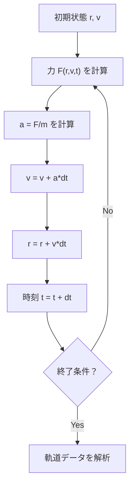

## 03-C1 無限を有限で刻む：数値解析とベクトルの実装

高校で学ぶ微積分は、とても強力です。  
でも現実の問題は、きれいな式で解けないことが多い。

そこで登場するのが数値解析。  
**連続な法則を、小さな離散ステップに翻訳して解く技術**です。

この章では、ベクトルと微積分を TypeScript に実装し、  
「式を読む」から「世界を動かす」へ進みます。

### 1. 導入：数式で解けない問題を攻略する

次のような問題は、解析解が難しくなります。

- 空気抵抗つきの落下
- 複数の天体が引き合う運動（N体問題）
- 複雑な力場での粒子軌道

理論式はわかっていても、手計算で厳密解は無理。  
このときコンピュータで「少し進める」を大量反復するのが数値解析です。

### 2. ベクトルをクラスにする：`Vector3D` の実装

`math_01_vector` で学んだベクトルを、そのままデータ構造にします。  
`x, y, z` をバラバラ管理せず、1つのオブジェクトとして扱うのがポイントです。

```ts
class Vector3D {
  constructor(
    public x: number,
    public y: number,
    public z: number
  ) {}

  add(v: Vector3D): Vector3D {
    return new Vector3D(this.x + v.x, this.y + v.y, this.z + v.z);
  }

  scale(k: number): Vector3D {
    return new Vector3D(this.x * k, this.y * k, this.z * k);
  }

  dot(v: Vector3D): number {
    return this.x * v.x + this.y * v.y + this.z * v.z;
  }

  norm(): number {
    return Math.sqrt(this.dot(this));
  }
}
```

利点：

- 演算ルール（足し算・スカラー倍）をメソッド化できる
- 2D/3D拡張でコードの形が崩れにくい
- 物理式をコードに直訳しやすい

### 3. オイラー法：微積分の離散化

`math_02_calculus` の微分定義

$$
\frac{dx}{dt}\approx \frac{\Delta x}{\Delta t}
$$

を逆に使えば、更新式が得られます。

$$
x_{n+1}=x_n+v_n\Delta t
$$

$$
v_{n+1}=v_n+a_n\Delta t
$$

これがオイラー法（前進オイラー）です。  
連続時間を「小さなコマ送り」に変換したものだと考えてください。

### 4. 🎯 知識の回収（Phase 3 Physicsより）

`physics_01_mechanics` の中核は

$$
m\vec{a}=\vec{F}
$$

でした。  
数値計算では次の順に処理します。

1. 力 $\vec{F}$ を計算
2. 加速度 $\vec{a}=\vec{F}/m$ を求める
3. 速度 $\vec{v}$ を更新
4. 位置 $\vec{r}$ を更新

これは「微分方程式をアルゴリズムに翻訳した形」です。

### 5. 実践：空気抵抗つき放物運動

空気抵抗を

$$
\vec{F}_{\text{drag}}=-k\vec{v}
$$

とすると、合力は

$$
\vec{F}=m\vec{g}-k\vec{v}
$$

です。  
式で解くのは面倒でも、コードでは力の式を1つ足すだけで済みます。

```ts
class Vector3D {
  constructor(public x: number, public y: number, public z: number) {}
  add(v: Vector3D): Vector3D { return new Vector3D(this.x + v.x, this.y + v.y, this.z + v.z); }
  scale(k: number): Vector3D { return new Vector3D(this.x * k, this.y * k, this.z * k); }
}

type State = {
  r: Vector3D; // 位置 [m]
  v: Vector3D; // 速度 [m/s]
};

const m = 1.0;            // 質量 [kg]
const k = 0.15;           // 抵抗係数 [kg/s]
const g = new Vector3D(0, -9.8, 0); // 重力加速度 [m/s^2]
const dt = 0.01;          // 時間刻み [s]
const steps = 400;

let s: State = {
  r: new Vector3D(0, 0, 0),
  v: new Vector3D(12, 18, 0), // 初速ベクトル
};

const trajectory: Array<{ t: number; x: number; y: number }> = [];

for (let n = 0; n < steps; n++) {
  const t = n * dt;

  // 力: F = mg - kv
  const Fg = g.scale(m);
  const Fdrag = s.v.scale(-k);
  const F = Fg.add(Fdrag);

  // 加速度: a = F/m
  const a = F.scale(1 / m);

  // オイラー更新
  s.v = s.v.add(a.scale(dt));
  s.r = s.r.add(s.v.scale(dt));

  trajectory.push({ t, x: s.r.x, y: s.r.y });

  if (s.r.y < 0) break; // 地面に到達
}

console.log(trajectory.slice(0, 10));
```

このコードは2D風に見えますが、実体は3Dベクトルです。  
`z` 成分を使えば、そのまま3次元へ拡張できます。

### 6. 精度の問題：$\Delta t$ の魔法と罠

Phase 1 の「離散と連続」を思い出そう。  
数値計算は、連続現象を離散ステップで近似します。

- $\Delta t$ を小さくするほど連続に近づく
- でも計算回数は増える
- 丸め誤差や離散化誤差はゼロにはならない

特に単純なオイラー法では、長時間計算でエネルギーがずれることがあります。  
これは「数値積分法の選び方」が重要だというサインです。

### 7. 数値積分のステップ図



### 8. 🚀 未来への伏線コラム

> **🚀 未来への伏線：シンプレクティック積分とHMC**
> オイラー法は入口として優秀だが、長時間のエネルギー保存は苦手。  
> そこで解析力学と相性の良いシンプレクティック積分法が登場する。  
> これらは位相空間の構造を守りながら時間発展を計算できる。  
> さらに先では、この発想がハミルトニアン・モンテカルロ（HMC）へ直結し、  
> 格子ゲージ理論シミュレーションの核心技術になっていく。

### 9. やってみよう

#### 実験1：重力を変える
`g` を変えて軌道を比較しよう（地球・月・木星）。

#### 実験2：抵抗係数を変える
`k = 0, 0.05, 0.2` で飛距離と最高点を比較しよう。

#### 実験3：時間刻みを変える
`dt = 0.1, 0.01, 0.001` で結果がどう安定するかを観察しよう。

#### 実験4：ログを可視化用に保存
`trajectory` 配列をCSV風文字列にして、散布図を作ってみよう。

```ts
const csv = trajectory.map(p => `${p.t},${p.x},${p.y}`).join("\n");
console.log(csv);
```

#### 実験5：エネルギー誤差を観察
運動エネルギーと位置エネルギーを計算し、  
時間とともにどれだけずれるかを出力してみよう。

### 10. この章のまとめ

- 数値解析は、連続な微積分を離散ステップへ翻訳する技術。
- ベクトルをクラス化すると、多次元物理を安全に実装できる。
- オイラー法は更新式の本質を学ぶ最初の武器。
- 力学の運動方程式は「力→加速度→速度→位置」のループで解ける。
- $\Delta t$ は精度と計算量のトレードオフを決める重要パラメータ。
