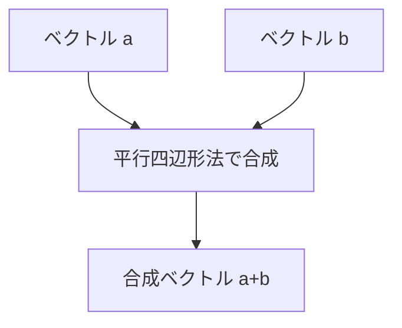
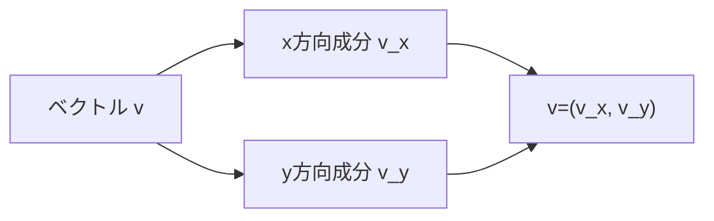

## 03-1 向きを持つ数：ベクトルの誕生

これまでの数学では、主に「大きさ」を扱ってきました。  
でも空間の現象を本気で記述するには、もう1つ必要な情報があります。  
それが**向き**です。

温度や質量のように向きを持たない量をスカラー、  
力や速度のように向きを持つ量をベクトルと呼びます。  
ここから、数の世界は1次元の直線から2次元・3次元へ広がります。

### 1. 導入：数にも「向き」がある世界へ

スカラーとベクトルを比べてみよう。

- スカラー：温度 25 ℃、質量 2 kg
- ベクトル：東向き 5 m/s、西向き 3 N

同じ「5」でも、向きが違えば意味は変わります。  
この違いを数学で正確に扱うために、ベクトルが生まれました。

> **🚀 未来への伏線：次元を上げる思考**
> ベクトルは「数字を増やす」道具ではなく、「世界の自由度」を増やす道具。  
> 1次元の線の発想を、2次元の面、3次元の空間へ拡張していく第一歩だよ。

### 2. ベクトルの定義：矢印と成分

平面上で、始点から終点へ向かう矢印を考えます。  
この矢印が表すのは「どれだけ・どちらへ動くか」です。

重要な性質：

- 長さと向きが同じなら、位置を平行移動しても同じベクトル
- ベクトルは「場所」より「変位の内容」を表す

成分表示では、

$$
\vec{a}=(x,y)
$$

と書きます。  
これは「$x$ 方向に $x$、$y$ 方向に $y$ だけ進む」という意味です。

3次元なら

$$
\vec{a}=(x,y,z)
$$

となります。

### 3. 🎯 知識の回収（Phase 2 Physicsより）

`physics_01_force` で描いた力の矢印を思い出そう。  
あれはまさにベクトルです。

- 右向き 6 N
- 左向き 4 N

この合力を求める操作は、物理的には「力の合成」、  
数学的には「ベクトルの足し算」です。

$$
\vec{F}_{\text{net}}=\vec{F}_1+\vec{F}_2
$$

ここで大事な注意：  
ベクトルになっても、単位は消えません。  
力ベクトルの単位は N、速度ベクトルの単位は m/s のままです。

### 4. ベクトルの演算：足し算とスカラー倍

#### 足し算（幾何）

ベクトル $\vec{a}$ の先端に $\vec{b}$ の始点をつないで、  
最初の始点から最後の先端へ引いた矢印が $\vec{a}+\vec{b}$ です。

#### 足し算（代数）

$$
\vec{a}=(a_1,a_2),\ \vec{b}=(b_1,b_2)
$$

なら

$$
\vec{a}+\vec{b}=(a_1+b_1,\ a_2+b_2)
$$

となります。  
図形の規則と成分計算が一致するのが、ベクトルの気持ちよさです。

#### スカラー倍

実数 $k$ に対し、

$$
k\vec{a}=(ka_1,ka_2)
$$

です。  
$k>0$ なら同じ向きに伸縮、$k<0$ なら向きを反転して伸縮します。

### 5. 内積（Dot Product）：重なりの強さ

ベクトルの「掛け算」の1つが内積です。

$$
\vec{a}\cdot\vec{b}=|\vec{a}||\vec{b}|\cos\theta
$$

また、成分で書けば

$$
\vec{a}\cdot\vec{b}=a_1b_1+a_2b_2
$$

です（2次元の場合）。

内積は「どれだけ同じ向きを向いているか」を数値化します。

- 同じ向きに近い：正で大きい
- 直交：0
- 反対向き：負

> **🎯 知識の回収：仕事の式の正体**
> `physics_02_energy` で学んだ仕事の式
> $$
> W=Fs\cos\theta
> $$
> は、実は力ベクトル $\vec{F}$ と変位ベクトル $\vec{s}$ の内積
> $$
> W=\vec{F}\cdot\vec{s}
> $$
> そのもの。  
> つまり「エネルギーの計算」は、ベクトルの重なりを測っていたんだ。

### 6. 図でつかむ：合成と分解

ベクトルは「まとめる（合成）」ことも「ほどく（分解）」こともできます。  
物理ではこの往復が、問題解決の基本操作です。

### 7. 🚀 未来への伏線コラム

> **🚀 未来への伏線：ベクトルは矢印だけじゃない**
> 高校のうちは、ベクトルは空間の矢印として学ぶ。  
> でも大学の線形代数では、関数の集まりや数列も「ベクトル」として扱える。  
> さらに行列は、ベクトルを別のベクトルへ写す変換として現れる。  
> 物理の最前線では、空間ごとに状態をつなぐ「接続」の考え方（ゲージ理論）にも進んでいく。  
> いまの成分計算は、その壮大な抽象化への入口なんだ。

### 8. やってみよう

#### 問題1：成分の足し算
$$
\vec{a}=(2,3),\ \vec{b}=(-1,4)
$$
のとき、$\vec{a}+\vec{b}$ を求めなさい。

- 計算：$(2+(-1),\ 3+4)$
- 答え：$(1,7)$

#### 問題2：スカラー倍
$$
\vec{a}=(3,-2)
$$
に対して $-2\vec{a}$ を求めなさい。

- 計算：$-2(3,-2)$
- 答え：$(-6,4)$

#### 問題3：内積
$$
\vec{a}=(1,2),\ \vec{b}=(4,-1)
$$
の内積を求めなさい。

- 計算：$1\cdot 4+2\cdot(-1)$
- 答え：$2$

#### 問題4：角度の判定
内積が 0 のとき、2つのベクトルのなす角は何度？

- 答え：90度（直交）

### 9. この章のまとめ

- ベクトルは「大きさ＋向き」を持つ量で、空間の記述に必須。
- 力の合成は、数学的にはベクトル加法そのもの。
- ベクトル計算は、図形的な操作と成分計算が一致する。
- 内積は「重なりの強さ」を測り、仕事 $W=\vec{F}\cdot\vec{s}$ と直結する。
- ベクトルの発想は、線形代数・行列・現代物理へ拡張されていく。
