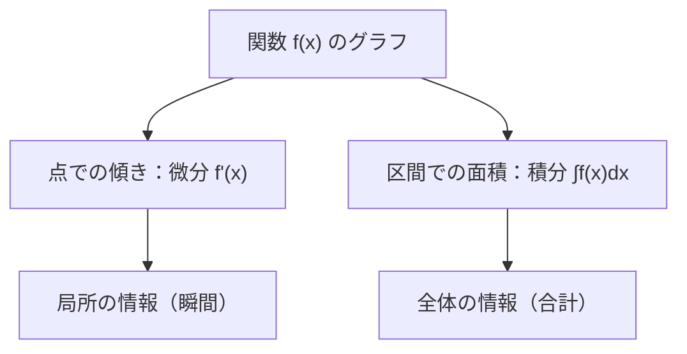

## 03-2 変化を刻み、積み上げる：微積分の世界

`math_01_numbers` で学んだように、長さ・時間・速さは**連続量**です。  
連続だからこそ、「どこまでも細かく見る」という戦略が使えます。  
その戦略を数学として完成させたのが、微分積分です。

この章では、

- 一瞬の変化をつかむ（微分）
- 小さな変化を積み上げる（積分）

という、物理を読むための最重要言語を手に入れます。

### 1. 導入：変化の「その瞬間」を見る

`math_02_ratio` で速さを

$$
\text{平均の速さ}=\frac{\Delta x}{\Delta t}
$$

と学びました。  
ここで $\Delta x$ は移動距離、$\Delta t$ はかかった時間です。

でも物理では、こう聞きたくなります。  
**「この瞬間の速さは？」**

グラフで言えば、2点を結ぶ直線の傾き（平均）から、  
1点での接線の傾き（瞬間）へ進むことになります。

### 2. 微分（Differentiation）：一瞬を切り取る魔法

瞬間の変化率は、極限の考え方で定義します。

$$
\frac{dx}{dt}=\lim_{\Delta t\to 0}\frac{\Delta x}{\Delta t}
$$

「$\Delta t$ を 0 に近づける」ことで、  
平均変化率から瞬間変化率へ到達するわけです。

一般の関数 $y=f(x)$ なら、導関数は

$$
f'(x)=\lim_{\Delta x\to 0}\frac{f(x+\Delta x)-f(x)}{\Delta x}
$$

で定義されます。  
ライプニッツ記法では

$$
\frac{dy}{dx}
$$

と書きます。  
この記法の良さは、「何を何で割った変化か」がひと目でわかることです。

### 3. 🎯 知識の回収（Phase 2 Physicsより）

`physics_01_force` で扱った運動の言葉を、微分でつなぐと次の鎖になります。

$$
v=\frac{dx}{dt},\qquad a=\frac{dv}{dt}=\frac{d^2x}{dt^2}
$$

- 位置 $x$ を時間微分すると速度 $v$
- 速度 $v$ を時間微分すると加速度 $a$

ここに `math_01_vector` の視点を重ねると、  
位置がベクトル $\vec{r}(t)$ のとき

$$
\vec{v}=\frac{d\vec{r}}{dt},\qquad \vec{a}=\frac{d\vec{v}}{dt}
$$

となります。  
つまりベクトルも、時間で微分できるのです。

### 4. 積分（Integration）：微かな変化を積み上げる

積分は「小さな量の合計」です。  
幾何学的には、グラフの下の面積として解釈できます。

$$
\int_a^b f(x)\,dx
$$

は、$x=a$ から $x=b$ までの総量を表します。

> **🎯 知識の回収：仕事の式の拡張**
> `physics_02_energy` では一定の力で
> $$
> W=Fs
> $$
> を学びました。  
> もし力が位置で変わるなら、小区間ごとに足し上げて
> $$
> W=\int F(x)\,dx
> $$
> となります。  
> これは「変化する力」に対する、積分の自然な使い方です。

### 5. 微積分学の基本定理：逆操作であることの感動

微分は「刻む」、積分は「積む」。  
この2つは独立ではなく、深く結びついています。

もし

$$
F'(x)=f(x)
$$

なら

$$
\int_a^b f(x)\,dx=F(b)-F(a)
$$

です。  
これが微積分学の基本定理。  
積分を、原始関数の差で一気に計算できる理由です。

### 6. 次元解析の徹底

微積分は式変形だけでなく、単位の意味まで運びます。

#### 微分すると「割る」

たとえば

$$
v=\frac{dx}{dt}
$$

なので次元は

$$
[v]=\frac{[x]}{[t]}=\frac{L}{T}
$$

です。  
さらに

$$
a=\frac{dv}{dt}
$$

だから

$$
[a]=\frac{L/T}{T}=LT^{-2}
$$

となります。

#### 積分すると「掛ける」

$$
\int v\,dt
$$

は次元的に

$$
[v][t]=\frac{L}{T}\cdot T=L
$$

となり、位置（長さ）に戻ります。  
微分と積分が逆であることは、次元でも確認できます。

### 7. 図でつかむ：微分と積分の往復

### 8. 🚀 未来への伏線コラム

> **🚀 未来への伏線：世界は微分方程式で書かれている**
> 物理法則の多くは、「量とその変化率の関係」として表される。  
> ニュートンの運動方程式、マクスウェル方程式、シュレディンガー方程式は、その代表例。  
> さらに変数が1つでなくなると、偏微分（$\partial/\partial x$ など）が登場する。  
> いま学ぶ微積分は、未来の理論物理を読むための共通OSなんだ。

### 9. やってみよう

#### 問題1：基本微分
$$
f(x)=x^3-2x^2+1
$$
を微分しなさい。

- 答え：$f'(x)=3x^2-4x$

#### 問題2：基本積分
$$
\int (2x+3)\,dx
$$
を求めなさい。

- 答え：$x^2+3x+C$

#### 問題3：速度から位置
速度が
$$
v(t)=4t
$$
のとき、位置 $x(t)$ を求めなさい（積分定数を $C$ とする）。

- 計算：$x(t)=\int 4t\,dt=2t^2+C$
- 答え：$x(t)=2t^2+C$

#### 問題4：自由落下の加速度
自由落下で
$$
v(t)=gt
$$
なら、加速度 $a(t)$ は？

- 計算：$a(t)=\frac{dv}{dt}=g$
- 答え：一定値 $g$

#### 問題5：仕事の積分
位置 $x$ によって力が
$$
F(x)=3x
$$
と変わるとき、$x=0$ から $x=2$ までの仕事を求めなさい。

$$
W=\int_0^2 3x\,dx=\left[\frac{3}{2}x^2\right]_0^2=6
$$

- 答え：$6\ \text{J}$

### 10. この章のまとめ

- 連続量を扱うことで、瞬間変化（微分）を定義できる。
- 微分は傾き・変化率、積分は面積・総量を表す。
- 速度や加速度は、位置の時間微分として統一的に書ける。
- 力が変化する場合の仕事は、積分 $W=\int F\,dx$ で表せる。
- 微分と積分は基本定理で結ばれ、物理法則の核心を支える。
