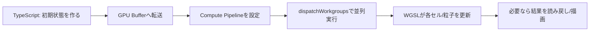

## 04-C1 並列宇宙の計算機：WebGPUによる超高速演算

`comp_01_numerical` では、CPUで1ステップずつ世界を更新しました。  
この章では、その更新を**数千・数万点で同時実行**する方法を学びます。

キーワードは WebGPU。  
現代物理の大規模シミュレーション（格子QCD・流体・プラズマ）に直結する道具です。

### 1. 導入：なぜGPUで物理を解くのか？

宇宙は、空間の1点ずつ順番に進んでいるわけではありません。  
「あらゆる場所で同時に」時間が進みます。  
場の方程式を解くなら、その計算モデルも並列である方が自然です。

よくあるたとえ：

- CPU：少数の天才が順番に仕事
- GPU：数千人の作業員が同時に同じ種類の仕事

格子ゲージ理論のように、格子点が莫大な計算ではGPUがほぼ必須です。

### 2. WebGPUのアーキテクチャ：データの流れ

WebGPUは「CPUが司令塔、GPUが並列計算機」という分担です。

1. CPU（TypeScript）でデータを準備
2. Buffer に詰めて GPU へ転送
3. GPU（WGSL）で並列更新
4. 必要なら結果を CPU 側へ読み戻す

`math_01_linear_alg` との接続で言えば、  
ベクトル・行列・状態ベクトルは、連続メモリ（配列）としてBufferに置かれます。  
線形写像 $y=Ax$ もGPUで大量並列に評価できます。

### 3. WGSL：物理法則を書くためのシェーダー言語

WebGPUのGPU側コードは WGSL で書きます。  
TypeScript が「段取り」、WGSL が「実計算」です。

- TypeScript：Device取得、Buffer作成、パイプライン構築、dispatch
- WGSL：各スレッドが担当セル/粒子を更新

「物理法則を関数化してGPUに流す」というイメージで捉えるとわかりやすいです。

### 4. Compute Shader：並列計算の心臓部

Compute Shader では、各スレッドが自分のIDを持ちます。

- 自分は何番目の格子点か？
- その点の状態は何か？
- 近傍点の情報は何か？

をIDから決めて更新します。

`math_02_diff_eq` の視点では、  
偏微分方程式の離散化（差分）を空間全点で同時に進める操作です。  
つまり「場の時間発展」をそのまま並列化している。

### 5. 実践：数万個の粒子の並列演算

ここでは、2D粒子の位置更新を最小例で示します。  
CPUの `for` ループで1個ずつ回さず、GPUスレッドに一括委譲します。

#### TypeScript（ホスト側）

```ts
const particleCount = 65536;
const floatsPerParticle = 4; // x, y, vx, vy

const adapter = await navigator.gpu.requestAdapter();
if (!adapter) throw new Error("GPU adapter not found");
const device = await adapter.requestDevice();

const stateBuffer = device.createBuffer({
  size: particleCount * floatsPerParticle * 4,
  usage: GPUBufferUsage.STORAGE | GPUBufferUsage.COPY_DST | GPUBufferUsage.COPY_SRC,
});

const dtBuffer = device.createBuffer({
  size: 4,
  usage: GPUBufferUsage.UNIFORM | GPUBufferUsage.COPY_DST,
});

device.queue.writeBuffer(dtBuffer, 0, new Float32Array([0.016]));
device.queue.writeBuffer(stateBuffer, 0, initialStateFloat32Array);

const shaderModule = device.createShaderModule({ code: wgslCode });

const pipeline = device.createComputePipeline({
  layout: "auto",
  compute: { module: shaderModule, entryPoint: "main" },
});

const bindGroup = device.createBindGroup({
  layout: pipeline.getBindGroupLayout(0),
  entries: [
    { binding: 0, resource: { buffer: stateBuffer } },
    { binding: 1, resource: { buffer: dtBuffer } },
  ],
});

const encoder = device.createCommandEncoder();
const pass = encoder.beginComputePass();
pass.setPipeline(pipeline);
pass.setBindGroup(0, bindGroup);
pass.dispatchWorkgroups(Math.ceil(particleCount / 256));
pass.end();
device.queue.submit([encoder.finish()]);
```

#### WGSL（GPU側）

```wgsl
struct Particle {
  x: f32,
  y: f32,
  vx: f32,
  vy: f32,
}

@group(0) @binding(0) var<storage, read_write> particles: array<Particle>;
@group(0) @binding(1) var<uniform> dt: f32;

@compute @workgroup_size(256)
fn main(@builtin(global_invocation_id) gid: vec3<u32>) {
  let i = gid.x;
  if (i >= arrayLength(&particles)) {
    return;
  }

  // 例: 一定重力 (0, -9.8)
  particles[i].vy = particles[i].vy - 9.8 * dt;
  particles[i].x = particles[i].x + particles[i].vx * dt;
  particles[i].y = particles[i].y + particles[i].vy * dt;
}
```

この更新式は `comp_01_numerical` のオイラー法と同じです。  
違いは「1点ずつ順番」か「全点同時」かだけです。

### 6. CPU-GPUパイプライン図



### 7. 🚀 未来への伏線コラム

> **🚀 未来への伏線：格子上の宇宙をシミュレートする**
> 格子QCDでは、空間を格子点に分け、各リンクにゲージ変数を置く。  
> 更新ルールは局所的だが、点数は巨大。だから並列計算が本質になる。  
> WebGPUで学ぶ「Buffer設計」「近傍参照」「並列更新」は、  
> そのまま最終ゴールの格子ゲージ理論実装へつながる実戦スキルなんだ。

### 8. やってみよう

WebGPUの最小セットアップを、次の順でトレースしてみよう。

1. `navigator.gpu.requestAdapter()` でAdapter取得
2. `adapter.requestDevice()` でDevice取得
3. `createBuffer()` で状態配列をGPUメモリへ
4. `createShaderModule()` でWGSLを読み込む
5. `createComputePipeline()` で計算パイプライン生成
6. `createBindGroup()` でBufferをシェーダーへ接続
7. `beginComputePass()` → `dispatchWorkgroups()` で実行
8. 結果を描画または読み戻して検証

チェックポイント：

- `particleCount` を10倍にしてもコード構造は変わらないか？
- `workgroup_size` を変えたとき挙動はどう変わるか？
- `dt` を変えて数値安定性はどう変わるか？

### 9. この章のまとめ

- GPU並列計算は、場の時間発展を自然に実装する計算モデル。
- WebGPUでは TypeScript が司令、WGSL が並列実行を担う。
- ベクトル・行列・状態は Buffer 上の配列として扱う。
- 逐次ループの更新式は、そのまま並列スレッドに移植できる。
- この基盤が、最終到達点の格子QCDシミュレーションへ直結する。
