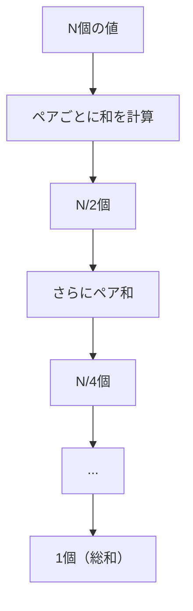

## 04-C2 計算の加速：並列アルゴリズムと行列演算の極意

`comp_01_webgpu` で、GPUを使った並列計算の入り口に立ちました。  
ここからは次の段階です。

**「動く」から「速く動く」へ。**

格子QCDのような巨大計算では、演算そのものより  
メモリアクセスの待ち時間が支配的になることが多い。  
この章では、GPUで待ちを減らす設計思想を学びます。

### 1. 導入：計算の「壁」を突破する

格子QCDでは、各格子点やリンクで  
$3\times 3$ 複素行列（$SU(3)$）演算を膨大に繰り返します。

単純実装の落とし穴：

- スレッドはたくさんある
- でも毎回Storage Bufferへ取りに行く
- メモリ待ちでALUが遊ぶ（GPUが退屈）

性能の本質は、「何回計算したか」だけではなく  
**どれだけデータを再利用できたか**です。

### 2. 行列演算の並列化（GEMM）

`math_01_linear_alg` の行列積

$$
C = AB,\qquad C_{ij}=\sum_k A_{ik}B_{kj}
$$

をGPUで並列化するとき、LGTでは次の特徴があります。

- 1つの巨大行列を掛けるのではない
- 大量の小行列（例：多数の $3\times 3$）を一斉に掛ける

これは「Batched GEMM」に近い問題です。

#### 配列レイアウトの重要性

複素数を `re, im` のペアで `f32` 配列に並べるとき、  
メモリ上の並びを統一しておくことが最重要です。

例（1行列 = 18個の `f32`）：

```ts
// [r00.re, r00.im, r01.re, r01.im, ..., r22.re, r22.im]
const su3Stride = 18; // f32 単位
const base = matrixIndex * su3Stride;
```

この規約が崩れると、理論が正しくても性能と正確性が同時に崩れます。

#### 割り当てのイメージ

- 1スレッド = 1行列の1要素（または1行）
- 1ワークグループ = 複数行列の小バッチ
- 同じ行列要素をグループ内で再利用

### 3. ワークグループと共有メモリ（Workgroup Storage）

GPUメモリは階層的です。

- Register: 最速、各スレッド専用
- Workgroup: 速い、同グループで共有
- Storage: 容量大、遅い

高速化の基本戦略：

1. Storage から必要データを一度だけ読む
2. Workgroup に載せる
3. 何度も再利用して計算
4. 結果だけStorageへ書く

これは物理でいう「近接作用」に似ています。  
遠く（遅いメモリ）へ毎回取りに行かず、  
近く（局所メモリ）で相互作用を完結させる設計です。

#### WGSLの雰囲気（共有メモリ利用）

```wgsl
var<workgroup> tileA: array<f32, 256>;
var<workgroup> tileB: array<f32, 256>;

@compute @workgroup_size(16, 16)
fn main(@builtin(local_invocation_id) lid: vec3<u32>,
        @builtin(global_invocation_id) gid: vec3<u32>) {
  // 1) Storage から読み込み
  // 2) tileA/tileB に置く
  workgroupBarrier();
  // 3) タイル内で積和を進める
  // 4) 結果を書き戻す
}
```

### 4. 並列リダクション：宇宙の総和を求める

`physics_01_analytical` では作用 $S$ が主役でした。  
格子計算では、局所量 $s_i$ の総和

$$
S=\sum_{i=1}^{N}s_i
$$

を何度も求めます。

CPUで1本ずつ足すと $O(N)$ の逐次処理。  
GPUでは木構造で同時に足していきます（並列リダクション）。

ステージ数は

$$
\log_2 N
$$

で、理想化すれば「並列ステップ」は $O(\log N)$。  
これがトーナメント方式の強みです。

#### WGSLの最小イメージ

```wgsl
var<workgroup> partial: array<f32, 256>;

// partial[lid] に値を入れた後
var stride: u32 = 128u;
loop {
  if (stride == 0u) { break; }
  if (lid.x < stride) {
    partial[lid.x] = partial[lid.x] + partial[lid.x + stride];
  }
  workgroupBarrier();
  stride = stride / 2u;
}
```

### 5. 🎯 知識の回収（Phase 4 Physicsより）

`physics_02_maxwell` や `physics_03_quantum` で扱った演算も、  
実装レベルでは次の形に落ちます。

- 場の局所更新：stencil（近傍参照）並列
- ハミルトニアン作用：行列・ベクトル演算の反復
- 作用評価：大規模リダクション

つまり理論式は違っても、計算パターンはかなり共通です。  
「局所演算 + 大域集約」がGPU実装の中心になります。

### 6. 図でつかむ：リダクションとメモリ階層




### 7. 🚀 未来への伏線コラム

> **🚀 未来への伏線：1024個のGPUをつなぐ**
> 1枚のGPUに収まらない格子サイズでは、領域分割（Domain Decomposition）を行う。  
> 空間をサブドメインに分け、境界データをGPU間通信で交換しながら時間発展を進める。  
> これは富岳のようなスーパーコンピュータで格子QCDを解く基本戦略。  
> いま学ぶ局所性・リダクション・メモリ最適化は、その分散版へそのまま拡張される。

### 8. やってみよう

#### ワーク1：リダクション段数を計算
$N=1024$ 個の値を2分木リダクションすると、段数は？

$$
\log_2 1024 = 10
$$

#### ワーク2：逐次 vs 並列の比較

- 逐次加算：ステップ数 $N-1$
- 並列リダクション：段数 $\log_2 N$

$N=1,048,576$ で両者を比較してみよう。

#### ワーク3：レイアウト設計
`SU(3)` を `f32` 配列に並べる規約を、自分の言葉で定義してみよう。

- 1行列あたり何個の `f32` か？
- 行優先/列優先のどちらか？
- 複素数の順序（re,im）をどう置くか？

#### ワーク4：TypeScript側のdispatch設計
粒子数 `N` と `workgroupSize` があるとき、必要ワークグループ数を計算する式を書こう。

```ts
const groups = Math.ceil(N / workgroupSize);
```

### 9. この章のまとめ

- GPU最適化の本質は、演算よりメモリ待ちを減らすこと。
- LGTでは「大量の小行列」をバッチ並列で捌く設計が重要。
- Workgroup共有メモリは、局所データ再利用の鍵。
- 大域量（作用など）は並列リダクションで効率よく集約する。
- この設計思想が、次章の本格的な格子QCD実装の土台になる。
