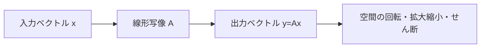
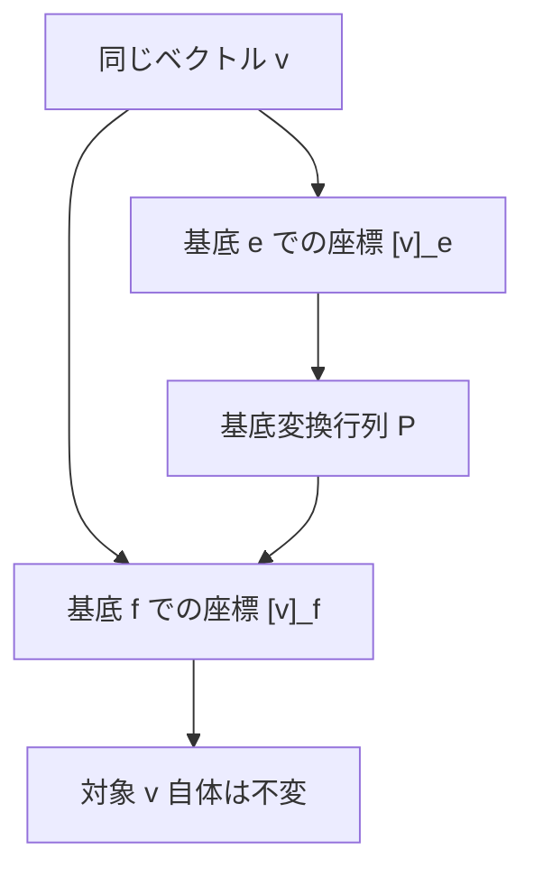

## 04-1 空間を操る言語：線形代数の本質

`math_01_vector` では、ベクトルを「向きと大きさを持つ矢印」として学びました。  
大学ではさらに一段抽象化して、ベクトルを「ベクトル空間の要素」として扱います。

ここでの主役は2つです。

- ベクトル空間（対象）
- 線形写像（操作）

そして行列は、線形写像を座標で書いた表現です。  
つまり行列は「数字の表」ではなく、**空間を変換する翻訳機**です。

### 1. 導入：数から多次元の「構造」へ

なぜ「線形」が重要なのか？  
理由はシンプルで、線形は扱いやすく、しかも本質を保ちやすいからです。

複雑な現象でも、小さな範囲では線形近似できることが多い。  
この思想は力学、電磁気、量子論、CG、機械学習まで共通します。

たとえば曲線運動も、微小区間ではほぼ直線。  
非線形な世界を、線形の積み重ねで読む。  
それが科学の王道です。

### 2. ベクトル空間と基底：世界を測る「めがね」

ベクトル空間 $V$ では、ベクトルの足し算とスカラー倍が定義され、  
次のような線形結合が作れます。

$$
\vec{v}=\sum_{i=1}^{n} c_i\vec{v}_i
$$

ここで $\{\vec{v}_1,\dots,\vec{v}_n\}$ が基底なら、  
任意のベクトルを一意に成分表示できます。

これは `math_01_numbers` の「単位（ものさし）」の抽象版です。  
基底とは、空間を測るための高次元のものさしセットだと言えます。

`math_01_vector` の成分表示も、実は「基底を固定した見え方」でした。  
基底を変えると成分は変わりますが、ベクトルそのものは不変です。

> **🎯 知識の回収：座標は変わる、本質は変わらない**
> 物理で座標系を回転しても同じ現象を記述できるように、  
> 線形代数では「表現」と「対象」を分離して考える。  
> これが“座標によらない本質”をつかむ第一歩です。

### 3. 行列は「写像」である：空間の翻訳機

線形写像 $T:V\to W$ は、加法とスカラー倍を保つ写像です。

$$
T(\alpha \vec{x}+\beta \vec{y})=\alpha T(\vec{x})+\beta T(\vec{y})
$$

基底を選ぶと、$T$ は行列 $A$ として表されます。

$$
\vec{y}=A\vec{x}
$$

この式は「入力ベクトルを、行列というルールで出力ベクトルへ変換する」  
という `math_02_function` の高次元版です。

さらに、写像の連続適用は行列積になります。  
$\vec{x}\xrightarrow{B}B\vec{x}\xrightarrow{A}A(B\vec{x})$ より

$$
\vec{y}=AB\vec{x}
$$

です。  
つまり $AB$ は「操作の合成」を表しています。

### 4. 固有値と固有ベクトル：変換に潜む「背骨」

一般に線形写像は向きを変えます。  
しかし特別な方向では、向きは変わらず伸縮だけ起こることがあります。

$$
A\vec{x}=\lambda \vec{x}
$$

この $\vec{x}$ が固有ベクトル、$\lambda$ が固有値です。

固有値問題は、「変換の本質軸」を見つける作業とも言えます。  
振動解析、主成分分析、量子力学など、応用は非常に広いです。

> **🎯 知識の回収：量子力学への接続**
> 量子論では、状態ベクトルに演算子が作用し、  
> 固有値が観測値として現れる。  
> いまの固有値方程式は、その数学的骨格そのものです。

### 5. 行列式（Determinant）：空間の拡大率

行列式 $\det A$ は、線形写像が体積を何倍にするかを表す量です。

- $|\det A|>1$：体積拡大
- $0<|\det A|<1$：体積縮小
- $\det A<0$：向き（向き付き体積）が反転
- $\det A=0$：空間をつぶして次元を落とす

特に重要なのは

$$
\det A\neq 0 \iff A^{-1}\ \text{が存在}
$$

という同値です。  
逆行列があるとは、「変換を元に戻せる」ことを意味します。

### 6. 図でつかむ：写像と基底変換

### 7. 🚀 未来への伏線コラム

> **🚀 未来への伏線：無限次元のベクトル空間へ**
> ここまでは有限次元ベクトル空間を扱った。  
> しかし関数全体の集合も、適切な演算を入れればベクトル空間になる。  
> 内積まで備えるとヒルベルト空間となり、量子力学の状態空間が現れる。  
> さらにゲージ理論では、各点で「内部空間の回転」をどうつなぐかが核心になる。  
> 線形代数は、現代物理の文法そのものなんだ。

### 8. やってみよう

#### 問題1：線形結合
基底
$$
\vec{e}_1=(1,0),\ \vec{e}_2=(0,1)
$$
に対して、$\vec{v}=(3,-2)$ を線形結合で表しなさい。

- 答え：$\vec{v}=3\vec{e}_1-2\vec{e}_2$

#### 問題2：2D回転行列
角度 $\theta$ の回転行列
$$
R(\theta)=
\begin{pmatrix}
\cos\theta & -\sin\theta\\
\sin\theta & \cos\theta
\end{pmatrix}
$$
で、$\theta=\pi/2$ のとき $(1,0)$ はどこへ移る？

- 計算：$R(\pi/2)(1,0)^\mathsf{T}=(0,1)^\mathsf{T}$
- 答え：$(0,1)$

#### 問題3：固有値・固有ベクトル
$$
A=
\begin{pmatrix}
2 & 0\\
0 & 3
\end{pmatrix}
$$
の固有値と固有ベクトルを求めなさい。

- 固有値：$\lambda_1=2,\ \lambda_2=3$
- 固有ベクトル：それぞれ $(1,0)^\mathsf{T},\ (0,1)^\mathsf{T}$ 方向

#### 問題4：行列式と可逆性
$$
B=
\begin{pmatrix}
1 & 2\\
2 & 4
\end{pmatrix}
$$
について $\det B$ を求め、逆行列の有無を答えなさい。

- $\det B=1\cdot 4-2\cdot 2=0$
- 答え：逆行列は存在しない（空間をつぶす変換）

#### 問題5：対角化で累乗を高速化
対角化可能な行列 $A=PDP^{-1}$ に対して、$A^n$ をどう書ける？

- 答え：$A^n=PD^nP^{-1}$
- ポイント：$D^n$ は対角成分を $n$ 乗するだけで計算できる

### 9. この章のまとめ

- ベクトル空間は、線形結合で構造を記述する抽象的な舞台。
- 基底は「見え方」を決めるが、ベクトル自体の本質は不変。
- 行列は線形写像の座標表現であり、行列積は写像の合成。
- 固有値・固有ベクトルは、変換に潜む不変方向と伸縮率を示す。
- 行列式は空間の拡大率を与え、可逆性 $\det A\neq 0$ を判定する。
