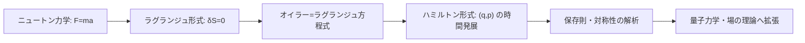

## 04-3 宇宙を統べる最小の原理：解析力学

`physics_01_mechanics` で私たちは

$$
m\vec{a}=\vec{F}
$$

を使って運動を追いました。  
これは非常に強力です。  
しかし、より高い視点では「力」よりも「作用」と「対称性」が主役になります。

解析力学は、宇宙をこう読む理論です。  
**自然は、作用 $S$ を極値にする道を選ぶ。**

### 1. 導入：なぜ解析力学が必要か？

ニュートン形式は、拘束条件が増えると式が煩雑になりやすいです。

- 糸でつながれた物体
- 曲面上を動く粒子
- 多体系や連成振動

これらを力ベクトルで1つずつ処理すると計算が重くなる。  
そこで解析力学では、ベクトルの力計算から、スカラー量（エネルギー）中心へ視点を移します。

この切り替えは、計算を楽にするだけでなく、  
理論の対称性を見抜く力を与えます。

### 2. 一般化座標と自由度

解析力学では、座標は $x,y,z$ に固定しません。  
系の本質を最も素直に表す座標を選びます。これが一般化座標 $q_i$ です。

例：

- 振り子：角度 $\theta$ を1つ選べば十分（自由度1）
- 二重振り子：$\theta_1,\theta_2$（自由度2）

これは `math_01_linear_alg` で学んだ基底の思想と同じです。  
座標（表現）を変えても、物理そのもの（対象）は変わらない。

> **🎯 知識の回収：座標は道具、法則が本体**
> どの基底で成分を書くかは自由。  
> 重要なのは、法則が座標選択に依らず同じ内容を保つこと。  
> 解析力学は、この不変性を最初から組み込んだ枠組みです。

### 3. ラグランジアン $L=T-V$ とオイラー＝ラグランジュ方程式

ラグランジアンを

$$
L(q_i,\dot{q}_i,t)=T-V
$$

と定義します。

- $T$：運動エネルギー
- $V$：ポテンシャルエネルギー

この $L$ から運動方程式が導かれます：

$$
\frac{d}{dt}\left(\frac{\partial L}{\partial \dot{q}_i}\right)-\frac{\partial L}{\partial q_i}=0
$$

これがオイラー＝ラグランジュ方程式です。  
`math_02_diff_eq` の言葉で言えば、これは明確な微分方程式系です。

#### 1次元粒子の確認

$$
L=\frac{1}{2}m\dot{x}^2-V(x)
$$

なら

$$
\frac{d}{dt}(m\dot{x})+\frac{dV}{dx}=0
\Rightarrow
m\ddot{x}=-\frac{dV}{dx}=F
$$

となり、ニュートン方程式が再現されます。

### 4. 最小作用の原理（ハミルトンの原理）

作用を

$$
S[q]=\int_{t_1}^{t_2}L(q,\dot{q},t)\,dt
$$

で定義します。  
ハミルトンの原理は

$$
\delta S=0
$$

を満たす軌道が実現する、という主張です。

直感的には、「宇宙は許された道の中で最も整合的な道を選ぶ」。  
この1行から、運動方程式全体が導かれるのが解析力学の美しさです。

### 5. ハミルトニアン $H=T+V$ と相空間

一般化運動量を

$$
p_i=\frac{\partial L}{\partial \dot{q}_i}
$$

と定義し、ハミルトニアンを

$$
H(q,p,t)=\sum_i p_i\dot{q}_i-L
$$

で定義します。  
標準的な力学系では $H=T+V$（全エネルギー）に一致します。

このとき力学は、相空間 $(q_i,p_i)$ で

$$
\dot{q}_i=\frac{\partial H}{\partial p_i},\qquad
\dot{p}_i=-\frac{\partial H}{\partial q_i}
$$

という1階連立方程式として書けます。

> **🚀 未来への伏線：相空間の力**
> この視点は統計力学の位相空間分布、HMC（ハミルトニアン・モンテカルロ）、  
> さらに量子力学の正準量子化へ直結する。  
> 位置と運動量を対等に扱う発想が、現代科学を支えている。

### 6. 対称性と保存則（ネーターの定理）

Phase 1 から出てきた「変わらないもの」は偶然ではありません。  
ネーターの定理は、対称性と保存則を1対1で結びます。

- 時間並進対称性 $\rightarrow$ エネルギー保存
- 空間並進対称性 $\rightarrow$ 運動量保存
- 回転対称性 $\rightarrow$ 角運動量保存

保存則は「経験的に見つかる規則」ではなく、  
ラグランジアンの対称性から必然的に生まれる構造なのです。

### 7. 力学理論の関係図

### 8. 🚀 未来への伏線コラム

> **🚀 未来への伏線：量子力学は解析力学の続き**
> 古典力学の作用 $S$ は、量子論では確率振幅の位相へと姿を変える。  
> ファインマンのパス積分では、あらゆる経路を重ね合わせ、作用が本質を決める。  
> さらに場の理論では、ゲージ対称性が許す作用を構成することが理論設計の中心になる。  
> つまり解析力学は「古典の最終章」ではなく、「現代物理の序章」なんだ。

### 9. やってみよう

#### 問題1：1次元調和振動子の導出
質量 $m$、ばね定数 $k$ の系で

$$
L=\frac{1}{2}m\dot{x}^2-\frac{1}{2}kx^2
$$

とする。オイラー＝ラグランジュ方程式から運動方程式を導け。

- 答え：$m\ddot{x}+kx=0$

#### 問題2：単振り子のラグランジアン
長さ $\ell$、質量 $m$、角度 $\theta$ を一般化座標とする。  
運動エネルギーとポテンシャルを求め、$L=T-V$ を書け。

- $T=\frac{1}{2}m\ell^2\dot{\theta}^2$
- $V=mg\ell(1-\cos\theta)$
- $L=\frac{1}{2}m\ell^2\dot{\theta}^2-mg\ell(1-\cos\theta)$

#### 問題3：単振り子の運動方程式
問題2からオイラー＝ラグランジュ方程式を作れ。

- 答え：$\ddot{\theta}+\frac{g}{\ell}\sin\theta=0$

#### 問題4：小振幅近似
$\sin\theta\approx\theta$ を用いて線形化し、角振動数を求めよ。

- 線形化：$\ddot{\theta}+\frac{g}{\ell}\theta=0$
- 答え：$\omega=\sqrt{\frac{g}{\ell}}$

#### 問題5：二重振り子の定式化（チャレンジ）
一般化座標を $(\theta_1,\theta_2)$ と選ぶと、なぜニュートン法よりラグランジュ法が有利かを説明せよ。

- 例答：拘束条件を反力として個別に処理せず、自由度に直接沿って式を構成できるため

### 10. この章のまとめ

- 解析力学は、力中心の視点を作用と対称性中心へ拡張する理論。
- 一般化座標により、問題に最適な座標系で法則を書ける。
- $L=T-V$ と $\delta S=0$ から運動方程式が統一的に導かれる。
- ハミルトニアン形式は相空間での時間発展を与える。
- 保存則は対称性の結果であり、ネーターの定理がその背後構造を示す。
