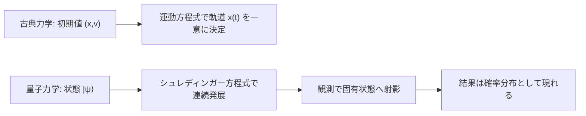

## 04-5 確率と波のアンサンブル：量子力学

この教材は小学校で「数える」と「測る」から始まりました。  
最終章では、その物語を量子力学で閉じます。

古典力学では、初期位置と速度がわかれば未来が決まる。  
量子力学では、状態は重ね合わせとして進化し、観測は確率的に現れる。  
この転換を、線形代数と微分方程式の言葉で理解します。

### 1. 導入：ミクロの世界の「ツブツブ」と「なめらかさ」

`math_01_numbers` のキーワードを回収しよう。

- 離散（ツブツブ）：飛び飛びの値
- 連続（なめらか）：切れ目ない変化

量子の世界では、この2つが同時に現れます。

- エネルギー準位は離散（例：原子スペクトル）
- 波動関数の時間発展は連続（微分方程式）

光電効果や原子の線スペクトルは、  
エネルギーが「好きな値」ではなく「量子（quanta）」として現れる証拠です。

### 2. 波としての存在：シュレディンガー方程式

量子状態は複素波動関数 $\psi(\vec{r},t)$ で表します。  
時間発展は

$$
i\hbar\frac{\partial \psi}{\partial t}
=\hat{H}\psi
$$

で与えられます。  
これは `math_02_diff_eq` の極致であり、複素関数の偏微分方程式です。

確率解釈では

$$
|\psi(\vec{r},t)|^2
$$

が位置 $\vec{r}$ で粒子を観測する確率密度を与えます。  
つまり粒子は「点」として観測されるが、進化は「波」で記述される。

### 3. 演算子と観測：状態を「射影」する

`math_01_linear_alg` で学んだ固有値問題が、ここで主役になります。  
物理量は演算子 $\hat{A}$ で表され、

$$
\hat{A}|a_n\rangle=a_n|a_n\rangle
$$

の固有値 $a_n$ が観測値です。

- 状態：$|\psi\rangle$
- 観測基底：$\{|a_n\rangle\}$
- 測定確率：$|\langle a_n|\psi\rangle|^2$

観測は「状態を固有基底へ射影する操作」と読めます。  
これにより、線形代数の抽象構造が物理的意味を持ちます。

> **🎯 知識の回収：固有値は“計算結果”ではなく“観測結果”**
> 高校までの固有値問題は数学練習に見えたかもしれない。  
> 量子力学ではそれが「実験で出る値」そのものになる。  
> ここで数学と物理が完全に重なる。

### 4. 不確定性原理：情報のトレードオフ

位置と運動量は、同時に無限精度では決められません。

$$
\Delta x\,\Delta p\ge \frac{\hbar}{2}
$$

これは測定器の不完全さではなく、理論の構造そのものです。

波の視点で言えば、

- 位置を鋭く局在化するほど、波数分布は広がる
- 波数が広がると、運動量 $p=\hbar k$ の不確かさが増える

`math_02_calculus` 的には、局在化と周波数広がりのトレードオフです。

### 5. ハミルトニアンと時間発展

`physics_01_analytical` で登場したハミルトニアン $H$ が、  
量子では演算子 $\hat{H}$ となって再登場します。

ブラケット記法で書くと

$$
i\hbar \frac{\partial}{\partial t}|\psi\rangle=\hat{H}|\psi\rangle
$$

です。  
古典で「エネルギー関数」だったものが、量子では「時間発展の生成子」になる。  
ここに解析力学と量子力学の劇的な連続性があります。

時間に依らない場合、定常状態は

$$
\hat{H}|n\rangle=E_n|n\rangle
$$

を満たし、固有値 $E_n$ がエネルギー準位を与えます。

### 6. 古典と量子の対比図

### 7. 🚀 未来への伏線（グランドフィナーレ）

> **🚀 未来への伏線：量子力学から場の量子論、そしてゲージ理論へ**
> 単一粒子の波動関数は、次の段階で「場の量子」に拡張される。  
> そこでは粒子は場の励起として現れ、相互作用はゲージ対称性で統一的に記述される。  
> 波動関数の位相自由度は、単なる数学的飾りではなく、力の構造を規定する核心になる。  
> 小学校で始めた「数を数える」という行為は、最終的に「量子を数える」理論へ帰ってきた。  
> これが、この教材の円環の完成です。

### 8. やってみよう（シミュレーションの窓）

#### 無限に深い井戸型ポテンシャル

区間 $0<x<L$ で $V(x)=0$、外側で $V=\infty$ とする。  
境界条件 $\psi(0)=\psi(L)=0$ から、許される定常波は

$$
\psi_n(x)=\sqrt{\frac{2}{L}}\sin\left(\frac{n\pi x}{L}\right),\quad n=1,2,3,\dots
$$

エネルギー固有値は

$$
E_n=\frac{n^2\pi^2\hbar^2}{2mL^2}
$$

となります。  
ここで $n$ が整数に制限されるため、エネルギーは離散化されます。

#### ミニ演習

1. $n=1,2,3$ の $E_n$ を書き、比 $E_1:E_2:E_3$ を求めよ。  
   - 答え：$1:4:9$
2. 箱の幅 $L$ を2倍にすると $E_n$ はどう変わるか。  
   - ヒント：$E_n\propto 1/L^2$  
   - 答え：$1/4$ 倍
3. $\psi_1(x)$ の節（ノード）の数を答えよ。  
   - 答え：内部ノード 0（端点を除く）
4. 時間発展を数値計算で行うとき、$x$ と $t$ を格子化して  
   離散シュレディンガー方程式を更新していく。  
   どの章の考え方に近いか説明せよ。  
   - 例答：`math_02_diff_eq` の差分化・時間発展の考え方

### 9. この章のまとめ

- 量子力学では、状態は波動関数（または状態ベクトル）で表される。
- シュレディンガー方程式は、量子状態の時間発展を与える基本法則。
- 観測値は演算子の固有値として現れ、確率は射影で決まる。
- 不確定性原理は、位置と運動量の本質的トレードオフを示す。
- 古典のハミルトニアンは、量子で時間発展演算子の中心へ昇華する。
