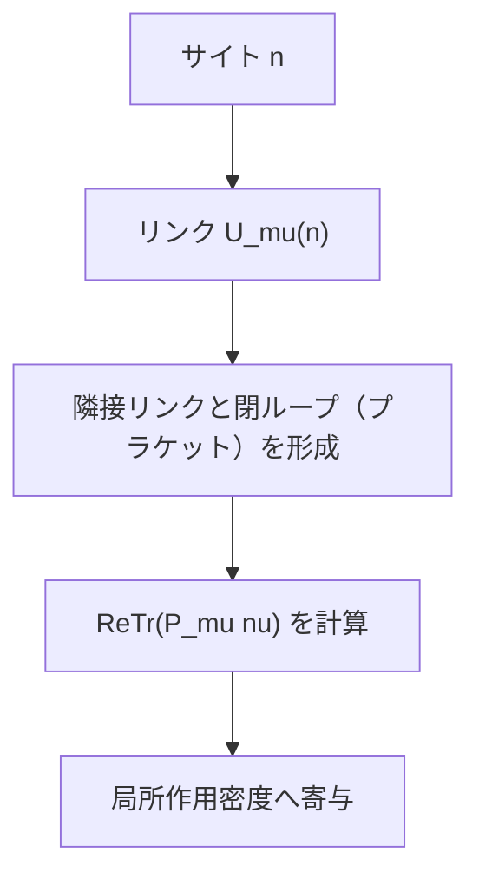
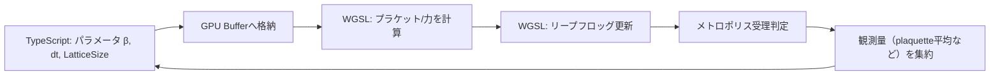

## 05-C2 格子上の宇宙：格子ゲージ理論の実装

ここは、この教材の到達点です。  
小学校で学んだ「数える」「測る」から始まり、  
ベクトル、微積分、線形代数、量子論、統計力学、HMCへとつながってきた旅が、  
いま「動くコード」として結実します。

この章のミッションは明確です。  
**WebGPUで $SU(3)$ 純粋ゲージ理論の最小シミュレータを組み上げる。**

### 1. 導入：すべてが繋がる場所

`math_01_numbers` の最初の問いは「離散と連続」でした。  
格子QCDはその問いへの実践的な答えです。

- 連続時空を、そのまま解析するのは困難
- そこで時空を格子点へ離散化
- 離散化された世界で量子場を統計的に計算

これは妥協ではなく、計算可能な宇宙を作るための設計です。  
連続理論の本質（ゲージ対称性）を保ちながら、  
コンピュータが扱える有限自由度へ落とし込みます。

### 2. リンク変数とサイト変数：場の幾何学

`math_group_theory` の回収ポイントはここです。  
ゲージ場はサイトではなくリンクに置きます。

- サイト（格子点）：$n$
- 方向：$\mu \in \{0,1,2,3\}$
- リンク変数：$U_\mu(n)\in SU(3)$

なぜリンクか？  
局所ゲージ変換 $G(n)\in SU(3)$ の下で

$$
U_\mu(n)\to G(n)\,U_\mu(n)\,G^\dagger(n+\hat{\mu})
$$

となり、サイト間の「平行移動」の幾何を自然に表せるからです。  
これがゲージ不変性を離散空間で保つ鍵です。

### 3. ウィルソン作用：格子上のマクスウェル方程式

`physics_02_maxwell` で学んだ場のエネルギー密度は、  
格子ではプラケット（最小ループ）で表されます。

プラケット：

$$
P_{\mu\nu}(n)=U_\mu(n)\,U_\nu(n+\hat{\mu})\,U_\mu^\dagger(n+\hat{\nu})\,U_\nu^\dagger(n)
$$

ウィルソン純粋ゲージ作用：

$$
S_G=\beta\sum_{n,\mu<\nu}\left(1-\frac{1}{N}\mathrm{Re\,Tr}\,P_{\mu\nu}(n)\right),\quad N=3
$$

$\mathrm{Re\,Tr}\,P$ が1に近いほど局所曲率が小さく、作用が小さい。  
つまり「格子上の場の滑らかさ」を測る量になっています。

### 4. WebGPUによる並列更新の実装

`comp_01_webgpu` と `comp_02_parallel_alg` を実戦投入します。  
リンク変数は莫大なので、4次元インデックスをフラット化してBuffer管理します。

#### 4次元フラット化（TypeScript）

```ts
type LatticeSize = { Nt: number; Nx: number; Ny: number; Nz: number };

function siteIndex(t: number, x: number, y: number, z: number, L: LatticeSize): number {
  return (((t * L.Nx + x) * L.Ny + y) * L.Nz + z);
}

function linkIndex(site: number, mu: number): number {
  // 1サイトあたり4方向
  return site * 4 + mu;
}

const su3FloatStride = 18; // 3x3 complex = 9 complex = 18 f32
const flatOffset = (linkIdx: number) => linkIdx * su3FloatStride;
```

#### WGSL並列更新の骨格（概念）

```wgsl
@group(0) @binding(0) var<storage, read_write> links: array<f32>;
@group(0) @binding(1) var<uniform> params: SimParams;

@compute @workgroup_size(128)
fn update_links(@builtin(global_invocation_id) gid: vec3<u32>) {
  let linkId = gid.x;
  if (linkId >= params.totalLinks) { return; }

  // 1) linkId -> (site, mu) を復元
  // 2) staple（近傍リンクの組）を読む
  // 3) 力または提案行列を作る
  // 4) U_mu(site) を更新
  // 5) 必要なら再ユニタリ化（SU(3)条件に近づける）
}
```

#### チェッカーボード更新

リンク更新の競合を抑えるため、赤黒分割（even/odd）を使います。

- Step A: evenサイト側を更新
- Step B: oddサイト側を更新

これで近傍依存の衝突を避けつつ並列度を確保できます。

### 5. HMCによるサンプリングの完成

`comp_monte_carlo` の骨格を、ゲージ場に拡張します。

1. 運動量（リー代数元）をガウス乱数で生成
2. $(U,P)$ のハミルトニアンを構成
3. リープフロッグで時間発展
4. メトロポリス判定で受理/棄却

概念的なハミルトニアン：

$$
H(U,P)=\frac{1}{2}\sum P^2 + S_G[U]
$$

受理確率：

$$
P_{\text{acc}}=\min(1,e^{-\Delta H})
$$

ここで重要なのは、理論と実装が1対1に対応していることです。

- $S_G$：プラケット計算カーネル
- 力 $\partial S/\partial U$：stapleから構築
- リープフロッグ：GPU上の反復更新

### 6. 🎯 全フェーズの最終回収

この章で、全フェーズの知識が一本に束ねられます。

- **単位**：全変数に次元的意味を持たせる
- **モデル化**：連続時空→格子モデル
- **保存則**：ハミルトニアン構造で安定更新
- **線形性**：行列・ベクトル演算の骨格
- **並列性**：局所更新をGPUで同時実行

画面上で回っている更新ループの1行1行に、  
小学校から積み上げた思想が埋め込まれています。

### 7. 図でつかむ：幾何とデータフロー





### 8. 🚀 未来への展望（エピローグ）

> **🚀 未来への展望：ここから先の宇宙**
> 今回実装したのは純粋ゲージ場（グルーオンのみ）の世界。  
> 次の段階では、フェルミオン（クォーク）を導入し、ディラック演算子の巨大連立解法へ進む。  
> そこからハドロン質量、有限温度QCD、初期宇宙プラズマの再現へ道が開ける。  
> あなたはもう「式を読む人」ではなく、「宇宙を計算する人」だ。

### 9. やってみよう

#### 実験：$\beta$ を変えてプラケット平均を測る

観測量：

$$
\langle P\rangle
=
\frac{1}{6V}
\sum_{n,\mu<\nu}\frac{1}{N}\mathrm{Re\,Tr}\,P_{\mu\nu}(n)
$$

#### 手順

1. $\beta = 5.4, 5.6, 5.8, 6.0$ で実行
2. 各点で熱化後サンプルから $\langle P\rangle$ を平均
3. $\beta$ vs $\langle P\rangle$ をプロット

#### 期待される観察

- $\beta$ 増加（結合弱化）で $\langle P\rangle$ が変化
- 格子間隔や相の違いを反映したトレンドが現れる

#### 実装メモ（TypeScript）

```ts
for (const beta of [5.4, 5.6, 5.8, 6.0]) {
  initializeGaugeField(beta);
  thermalize(2000);
  const values: number[] = [];
  for (let i = 0; i < 500; i++) {
    hmcTrajectory(); // GPU上で更新
    values.push(measurePlaquette());
  }
  const avg = values.reduce((a, b) => a + b, 0) / values.length;
  console.log(`beta=${beta}, <P>=${avg}`);
}
```

### 10. この章のまとめ

- 格子QCDは、連続理論を離散化して計算可能にする実践理論。
- リンク変数 $U_\mu(n)\in SU(3)$ がゲージ不変性の核心を担う。
- ウィルソン作用はプラケットを通じて場のエネルギーを定義する。
- WebGPU並列更新とHMCを組み合わせることで巨大自由度を扱える。
- ここまでの全学習内容が、1つのシミュレータとして統合された。
