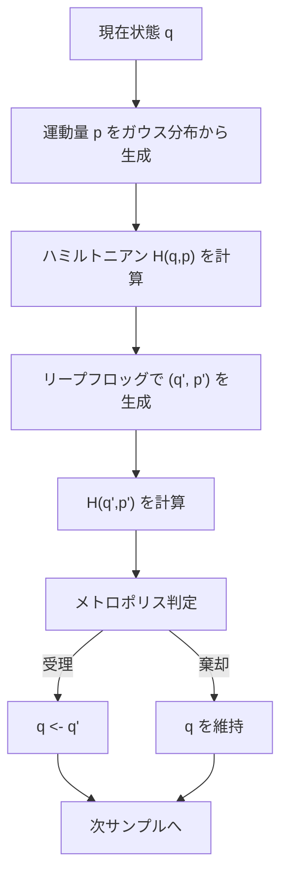

## 05-C1 宇宙をサンプリングする：モンテカルロ法とHMCアルゴリズム

`phys_statistical` で見た経路積分は、巨大な次元の積分でした。  
理論は美しい。でも全点を愚直に積分するのは不可能です。

ここで登場するのがサンプリング。  
**「重要な場所を重点的に訪れる」**ことで、期待値を現実的な計算量で求めます。

この章の主役は HMC（Hamiltonian Monte Carlo）。  
解析力学のハミルトニアンが、探索アルゴリズムとして再誕します。

### 1. 導入：次元の呪いとサンプリングの知恵

高次元積分の全数調査は、次元の呪いに負けます。  
たとえば格子場では自由度が数百万以上になることも珍しくありません。

`phys_statistical` の重みを思い出そう。

$$
P(q)\propto e^{-S(q)}
$$

重みが大きい（作用が小さい）領域ほど、物理量への寄与が大きい。  
ならば、その領域を中心にサンプルを集めればよい。  
これがモンテカルロ法の核心です。

### 2. マルコフ連鎖モンテカルロ（MCMC）

最も基本的な考えは、現在状態 $q$ から候補 $q'$ を作り、  
受理・棄却を繰り返して分布に従う連鎖を作ることです。

#### メトロポリス受理確率

$$
\alpha = \min\left(1,\ \exp[-(S(q')-S(q))]\right)
$$

ルールはシンプル：

- 作用が下がる（$S(q')<S(q)$）なら受理しやすい
- 作用が上がる提案も、少しは受理して探索を止めない

これは「もっともらしい状態を優先しつつ、局所最適にハマらない」仕組みです。

### 3. ハミルトニアン・モンテカルロ（HMC）の衝撃

通常のランダムウォークは高次元で遅い。  
酔っ払いのように少しずつしか進めず、自己相関が強くなります。

HMCはここで物理を使います。  
状態 $q$ に仮想運動量 $p$ を導入し、拡張ハミルトニアン

$$
H(q,p)=S(q)+\frac{1}{2}p^\mathsf{T}M^{-1}p
$$

を定義します。

- $S(q)$：ポテンシャル（作用）
- $\frac{1}{2}p^\mathsf{T}M^{-1}p$：運動エネルギー

そしてハミルトン方程式で、相空間を滑らかに移動して新提案を作ります。

$$
\dot{q}= \frac{\partial H}{\partial p},\qquad
\dot{p}= -\frac{\partial H}{\partial q}
$$

`physics_01_analytical` の完全回収です。  
物理の運動法則が、そのまま効率的探索アルゴリズムになる。

### 4. リープフロッグ法：GPUでも使える時間発展

連続方程式は、`comp_01_numerical` で学んだ離散化で解きます。  
ただしオイラー法より、エネルギー保存に優れたリープフロッグを使います。

ステップ $\epsilon$ の更新：

$$
p\leftarrow p-\frac{\epsilon}{2}\nabla S(q)
$$

$$
q\leftarrow q+\epsilon M^{-1}p
$$

$$
p\leftarrow p-\frac{\epsilon}{2}\nabla S(q)
$$

これを $L$ 回繰り返して提案 $(q',p')$ を作ります。  
その後、ハミルトニアン差でメトロポリス受理判定を行います。

### 5. 🎯 知識の回収（Phase 4 Universityより）

`math_01_linear_alg` の視点では、  
$q$ も $p$ も高次元ベクトルです。

- 勾配 $\nabla S(q)$：同次元ベクトル
- 更新：ベクトル加算とスカラー倍
- 質量行列 $M$：線形写像（実装では対角近似が多い）

つまりHMCは「高次元ベクトル場上の時間積分問題」。  
ここまでの線形代数・微分方程式・数値積分が全部つながります。

### 6. TypeScriptで書くHMCの骨格

以下は1次元〜多次元に拡張しやすい最小骨格です。

```ts
type Vector = Float64Array;

function gaussianMomentum(dim: number): Vector {
  const p = new Float64Array(dim);
  for (let i = 0; i < dim; i++) {
    // Box-Muller などで標準正規乱数を作る（ここは簡略化）
    p[i] = randomNormal();
  }
  return p;
}

function kinetic(p: Vector): number {
  let sum = 0;
  for (let i = 0; i < p.length; i++) sum += 0.5 * p[i] * p[i];
  return sum;
}

function leapfrog(
  q0: Vector,
  p0: Vector,
  stepSize: number,
  steps: number,
  gradS: (q: Vector) => Vector
): { q: Vector; p: Vector } {
  const q = q0.slice() as Vector;
  const p = p0.slice() as Vector;

  // half kick
  let g = gradS(q);
  for (let i = 0; i < q.length; i++) p[i] -= 0.5 * stepSize * g[i];

  for (let n = 0; n < steps; n++) {
    // drift
    for (let i = 0; i < q.length; i++) q[i] += stepSize * p[i];

    // kick
    g = gradS(q);
    const factor = n === steps - 1 ? 0.5 : 1.0;
    for (let i = 0; i < q.length; i++) p[i] -= factor * stepSize * g[i];
  }

  return { q, p };
}

function hmcStep(
  qCurrent: Vector,
  action: (q: Vector) => number,
  gradS: (q: Vector) => Vector,
  stepSize: number,
  leapfrogSteps: number
): { qNext: Vector; accepted: boolean } {
  const pCurrent = gaussianMomentum(qCurrent.length);

  const currentH = action(qCurrent) + kinetic(pCurrent);
  const proposal = leapfrog(qCurrent, pCurrent, stepSize, leapfrogSteps, gradS);
  const proposalH = action(proposal.q) + kinetic(proposal.p);

  const deltaH = proposalH - currentH;
  const acceptProb = Math.min(1, Math.exp(-deltaH));

  if (Math.random() < acceptProb) {
    return { qNext: proposal.q, accepted: true };
  }
  return { qNext: qCurrent, accepted: false };
}
```

命名を見れば物理の意味が読めるようにしてあるのがポイントです。  
`action`, `gradS`, `kinetic`, `deltaH` などが理論と1対1対応します。

### 7. HMCフロー図



### 8. 🚀 未来への伏線コラム

> **🚀 未来への伏線：いよいよ格子ゲージ理論へ**
> 今は「連続変数の山」をサンプリングした。  
> 格子QCDでは、これを「リンク変数（SU(3)行列）の海」へ置き換える。  
> すると更新対象はスカラーではなく行列になるが、骨格は同じ。  
> 作用を計算し、勾配（または力）を取り、リープフロッグで進め、受理判定する。  
> つまりHMCは、LGT実装のエンジンそのものなんだ。

### 9. やってみよう

#### 1次元ガウス分布をHMCでサンプル

目標分布：

$$
P(q)\propto e^{-q^2/2}
$$

なので作用は

$$
S(q)=\frac{1}{2}q^2,\qquad \nabla S(q)=q
$$

#### 実験手順

1. 初期値 $q_0=5$ から開始
2. `stepSize` と `leapfrogSteps` を設定
3. 10,000 ステップ回して `q` を記録
4. 平均と分散を計算し、理論値（0, 1）に近いか確認

#### チェックポイント

- 受理率が低すぎる（<40%）なら `stepSize` を小さく
- 受理率が高すぎる（>95%）なら探索が短すぎる可能性
- `deltaH` の分布が大きく崩れていないか確認

### 10. この章のまとめ

- 経路積分の実計算には、重要領域を狙うサンプリングが不可欠。
- MCMCは受理・棄却で目標分布を実現するマルコフ連鎖を作る。
- HMCはハミルトニアン力学を使って高次元空間を効率的に探索する。
- リープフロッグ法はエネルギー誤差を抑える要となる。
- この骨格を行列値場へ拡張すると、格子QCDの本格実装に到達する。
