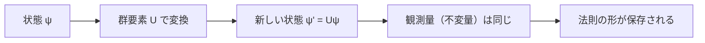

## 05-1 宇宙の対称性を解き明かす：群論とリー代数

`math_01_linear_alg` で学んだ行列は、ただの計算道具ではありません。  
物理では、行列は「対称性の変換」そのものを表します。

この章の主役は次の問いです。  
**何を変えても法則が変わらないとき、何が起きるのか？**

その答えが、群論・リー代数・ゲージ対称性です。

### 1. 導入：物理学における「美しさ」と「対称性」

物理法則には、ある種の「不変性」があります。

- 座標を回転しても、法則の形が同じ
- 時刻をずらしても、法則の形が同じ
- 位相を変えても、観測量が同じ

「変えても変わらない」があるとき、そこに深い法則があります。

対称性には2種類あります。

- **離散群**：有限回の操作（例：正方形の回転・反転）
- **連続群**：連続パラメータで変換（例：角度 $\theta$ の回転）

物理の基本相互作用を決めるのは、後者の連続対称性（リー群）です。

### 2. 群の定義：数学的な「作法」

集合 $G$ と演算 $\circ$ が群になるには、次を満たします。

1. **閉性**：$a,b\in G \Rightarrow a\circ b\in G$
2. **結合法則**：$(a\circ b)\circ c=a\circ(b\circ c)$
3. **単位元**：$e\circ a=a\circ e=a$
4. **逆元**：$a^{-1}\circ a=a\circ a^{-1}=e$

`math_01_linear_alg` の回収として、行列群を見よう。  
可逆行列全体 $GL(n)$ は行列積で群をなします。

- 単位元：単位行列 $I$
- 逆元：逆行列 $A^{-1}$
- 閉性：可逆行列同士の積は可逆

「行列積」と「行列式」の知識が、ここで宇宙の言語に昇格します。

### 3. リー群：なめらかな対称性

リー群は、群であり同時に滑らかな多様体でもある対象です。  
「連続的に変換できる対称性」を表します。

#### $U(1)$：位相回転

$$
e^{i\theta},\quad \theta\in\mathbb{R}
$$

複素平面の円周上の回転。電磁気学のゲージ対称性の核です。

#### $SU(2)$：2次元複素空間の特別ユニタリ群

スピンや弱い相互作用で現れます。

#### $SU(3)$：色の対称性

強い相互作用（QCD）のゲージ群。  
クォークの「色」自由度を回転する内部対称性です。

定義を明示すると：

$$
SU(N)=\{U\in \mathbb{C}^{N\times N}\mid U^\dagger U=I,\ \det U=1\}
$$

つまり「ユニタリ」かつ「行列式1」の行列群です。

### 4. 生成子とリー代数：無限小の変換

連続群の要素は、無限小変換の積み重ねとして書けます。

$$
U(\theta)=\exp\!\left(i\theta^a T^a\right)
$$

- $T^a$：生成子（ジェネレータ）
- $\theta^a$：連続パラメータ

`math_02_calculus` の視点では、指数写像は「微小変換の積分」です。  
`math_01_linear_alg` の視点では、$T^a$ は線形作用素（行列）です。

リー代数の核心は交換関係：

$$
[T^a,T^b]=i f^{abc}T^c
$$

ここで $f^{abc}$ は構造定数。  
群の「ねじれ方」を定量化する係数です。

`SU(2)` なら生成子としてパウリ行列、`SU(3)` ならゲルマン行列が使われます。

> **🎯 知識の回収：固有値と観測**
> 生成子（演算子）の固有値は、量子論で観測量と結びつく。  
> ここでも線形代数の固有値問題が、物理の実在に直結している。

### 5. ゲージ対称性：場所ごとに違う「ものさし」

グローバル対称性は「空間全体で同じ変換」。  
ゲージ対称性は「位置ごとに独立な変換」を許します。

$$
\psi(x)\to U(x)\psi(x),\quad U(x)\in SU(3)
$$

位置依存の変換で理論を不変に保つには、  
通常の微分 $\partial_\mu$ では不十分です。  
そこで共変微分

$$
D_\mu=\partial_\mu-ig A_\mu^a T^a
$$

が必要になり、ゲージ場 $A_\mu^a$（グルーオン）が要請されます。

これは `physics_02_maxwell` の電磁ポテンシャルの一般化です。  
「対称性を要求したら相互作用が現れる」というのが本質です。

### 6. 群作用のイメージ図

### 7. 🚀 未来への伏線コラム

> **🚀 未来への伏線：格子上のリンク変数**
> 連続空間のゲージ場は、格子では「サイト間のリンク変数」$U_\mu(x)\in SU(3)$ として表現される。  
> 場そのものではなく、隣接点を結ぶ並進演算子として保存することで、ゲージ対称性を離散世界でも保てる。  
> 次章の格子ゲージ理論実装では、このリンク変数をWebGPUで大量並列更新していく。  
> ここで学ぶ群の性質（ユニタリ性・行列式1・交換関係）が、実装の正しさチェック基準になる。

### 8. やってみよう

#### 問題1：群公理チェック
2次元回転行列

$$
R(\theta)=
\begin{pmatrix}
\cos\theta & -\sin\theta\\
\sin\theta & \cos\theta
\end{pmatrix}
$$

の集合が群をなすことを、4公理で確認しなさい。

#### 問題2：$SU(N)$ の条件
$U^\dagger U=I$ と $\det U=1$ の2条件が、  
それぞれ何を意味するかを言葉で説明しなさい。

#### 問題3：交換子計算（パウリ行列）
パウリ行列 $\sigma_i$ について

$$
\left[\frac{\sigma_1}{2},\frac{\sigma_2}{2}\right]
$$

を計算し、$i\epsilon_{123}\frac{\sigma_3}{2}$ になることを確かめなさい。

#### 問題4：ゲルマン行列の交換関係（挑戦）
ゲルマン行列 $\lambda_a$ を用いて

$$
T^a=\frac{\lambda_a}{2}
$$

としたとき、任意の2つを選んで交換子を計算し、  
$[T^a,T^b]=if^{abc}T^c$ の形になることを確認しなさい。

#### 問題5：局所対称性の意味
$U(x)$ が位置に依存するとき、なぜ単なる $\partial_\mu$ では不変性が壊れるか、  
1〜2文で説明しなさい。

### 9. この章のまとめ

- 群は「対称操作の作法」を定式化する数学構造。
- リー群は連続対称性を扱い、物理の基本相互作用を規定する。
- $SU(N)$ はユニタリ性と行列式1で定義される重要な行列群。
- 生成子と交換関係が、対称性の微小構造（リー代数）を与える。
- 局所ゲージ対称性を要求すると、ゲージ場が必然的に現れる。
